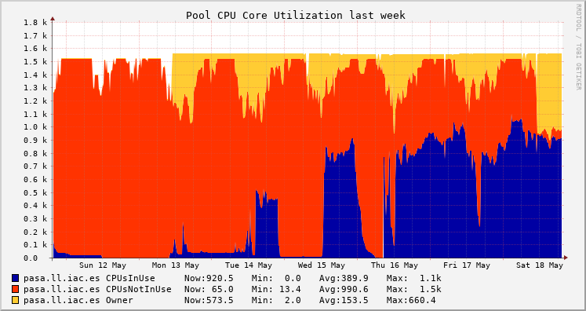

HTCondor
========

.. note::

   This documentation, together with example submit files and other
   material can be found in the
   `HTCondor@IAC <https://github.com/angel-devicente/htcondor-iac>`__
   repository.

.. note::

   Part of the HTCondor infrastructure at the IAC was financed by the
   Ministry of Economy and Competitiveness through FEDER funds, code
   IACA13-3E-2493.

Introduction
------------

.. warning::

   If you have no experience with HTCondor, we recommend that you
   contact us before running any job so we can give you a quick
   introduction (bear in mind that you will be using other users'
   computers and there are some basic guidelines that you must follow
   to avoid disturbing them).

What is HTCondor?
~~~~~~~~~~~~~~~~~

At the IAC we have several `Supercomputing
<http://research.iac.es/sieinvens/SINFIN/Main/supercomputing.php>`__ resources
that allow you to obtain your computational results in much less time and/or
work with much more complex problems. One of them is `HTCondor
<http://research.cs.wisc.edu/htcondor/>`__, a High Throughput Computing (`HTC
<http://en.wikipedia.org/wiki/High-throughput_computing>`__) system. The
underlying idea is quite simple (and powerful): let's use idle machines to
perform computations while their owners are away. So, in a nutshell, HTCondor is
an application that is installed in our PCs to make it possible to run a large
number of yours and others' computations at a time in different machines when
they are not being used, achieving a better utilization of our resources. A more
detailed overview of HTCondor is available at the `official documentation
<https://htcondor.readthedocs.io/en/23.0/overview/index.html>`__.

How can HTCondor help me?
~~~~~~~~~~~~~~~~~~~~~~~~~

HTCondor is very useful when you have an application that has to run a large
number of times over different input data. For instance, suppose you have a
program that carry out some calculations taking an image file as input. Let's
say that the processing time is about one hour per image and you want to process
250 images. Then you can use your own machine and process all images one by one,
and wait more than 10 days to get all results, or you can use HTCondor to
process each image in different computers and hopefully get all results in one
hour, or maybe two or four, but for sure less than 10 days. And HTCondor will do
all the work for you: it will copy the input files to the remote machines,
execute your program there with different inputs and bring back the results to
your machine when they are complete.

How **powerful** is HTCondor?
~~~~~~~~~~~~~~~~~~~~~~~~~~~~~

HTCondor calls a *slot* the unit that executes a job, typically a CPU or a core
if the CPU has several of them. Right now we have |SLOTS| slots that might
execute applications submitted via HTCondor. It means that everyday more than
|HOURS| hours could be available to run HTCondor jobs, close to |YEARS| years of
computation in a single day! Obviously, this is the theoretical maximum if no
one were using their computers and all slots were idle, but the number of actual
available slots could be around 600 during office hours and around 900 at nights
and weekends.

You can see real-time **HTCondor@IAC statistics** (global and per user) `here
<https://pasa.ll.iac.es/ganglia/?r=week&cs=&ce=&m=load_one&tab=v&vn=pool_usage&hide-hf=false>`__.
The figure below is an example showing the global usage where *Owner* represents
*slots* that are being used outside of HTCondor. The remaining *slots* are
available to HTCondor, but if there are no eligible jobs to run, those slots
will be in *CPUsNotInUse* state. Those *slots* that are actually being used by
HTCondor are those in the *CPUsInUse* state.

Which machines are part of HTCondor?
~~~~~~~~~~~~~~~~~~~~~~~~~~~~~~~~~~~~

HTCondor is installed in a number of *burros* (High Performance Linux PCs) and
desktop PCs at the IAC Headquarters in La Laguna.

Regarding their hardware specificatons, they are rather heterogeneous and their
availability and specifications change from time to time. You can check which
machines make up the HTCondor\@IAC pool at any given time in the `HTCondor
Ganglia webpage
<https://pasa.ll.iac.es/ganglia/?r=week&cs=&ce=&c=IAC+HTCondor&h=&tab=m&vn=&hide-hf=false&m=cpu_num&sh=1&z=small&hc=4&host_regex=&max_graphs=0&s=by+name>`__.

Regarding their software specifications, at present most machines are running
Ubuntu 22.04 and the installed software should be also more or less the same in
every machine (see the `software supported by the SIE
<http://research.iac.es/sieinvens/SINFIN/Main/software_sinfin.php>`__), which
makes it easy to run almost every application in any machine.

Detailed information about each machine can be obtained with the command
``condor_status`` (see Section `Checking pool status`_).

HTCondor provides a simple mechanism by which you can specify a set of
requirements for the machines where you want your application to run, for
example: memory per slot, OS version, etc. (see Section `Submit files`_).

How can I use HTCondor?
~~~~~~~~~~~~~~~~~~~~~~~

If you have an account in the IAC network, then you can use HTCondor.

HTCondor is a batch-processing system (i.e. non-interactive), so you
submit jobs to the HTCondor queue with the ``condor_submit`` command,
and providing a text submission file, where you specify the executable
file, its arguments, inputs and outputs, etc. (see Section `Submitting jobs`_).

You do not need to prepare or compile your programs in any special way
to run them, and almost all programming languages should be suitable
(shell scripts, Python, Perl, C, Fortran, IDL, etc.). Sometimes a few
minor modifications may be needed in order to specify arguments and the
locations of inputs or outputs.

Where will my application run?
~~~~~~~~~~~~~~~~~~~~~~~~~~~~~~

When you submit jobs to the HTCondor queue, HTCondor uses its allocation
algorithm to send and execute your jobs on those idle slots that satisfy
your requirements. Idle slots are those located in machines where there
has been no keyboard/mouse activity for a long time and the computer
load is low enough to ensure that there is no interference with the
owner's processes.

While HTCondor is running its jobs, it also keeps checking that the
owner is not using the machine. If HTCondor detects any activity in the
computer (for instance, keyboard activity), then it will suspend all its
jobs and wait a little while to see whether the machine gets idle again
so as to resume the jobs. If the machine does not become idle in a short
time, HTCondor will *vacate* it, interrupting all HTCondor jobs and
sending them to other available slots in any other idle machine.

HTCondor will repeat this process untill all jobs are done, optionally
sending notifications via email when they are finished or if any errors
show up.

Basic HTCondor workflow
~~~~~~~~~~~~~~~~~~~~~~~

The basic workflow with HTCondor will include four steps: checking the
HTCondor pool status, submitting a job, checking and managing the
submitted job, and getting information from the logs. Commands and
examples for these phases are given with further details in the
following sections, but here we present a very basic example to **Quick
Start** you.

-  **Checking the HTCondor pool status**

   You can use the command ``condor_status``, to quickly check the
   status of the HTCondor pool:

   ::

      [user@node ~]$ condor_status -compact
      Machine             Platform     Slots Cpus Gpus  TotalGb FreCpu  FreeGb  CpuLoad ST

      machine1.domain     x64/Ubuntu22  128S    1          3.93    128  503.38     1.24 Oi
      machine2.domain     x64/Ubuntu22   32S    1          3.93     64  251.50     0.00 Ui 

      [...]

                     Total Owner Claimed Unclaimed Matched Preempting  Drain Backfill BkIdle

        x64/Ubuntu18   128    48       0        80       0          0      0        0      0
        x64/Ubuntu22  1268   763      47       458       0          0      0        0      0

               Total  1396   811      47       538       0          0      0        0      0

-  **Submitting a job**

   In order to ask HTCondor to run you application you will need:

   -  **your application**

      For example, given the following basic C code (``simple.c``):

      .. literalinclude:: examples/hello_world/simple.c
         :language: C

      You would compile it as usual:

      .. code:: bash

         gcc -o simple simple.c

   -  **a submit file**

      The submit file is a plain text file that specifies the name of
      your executable (``simple``), how many jobs to submit
      (``Queue 100``), etc.

      .. literalinclude:: examples/hello_world/simple.submit

   -  **the "condor_submit" command**

      Using the *submit file* as an argument to the command
      ``condor_submit`` you instruct HTCondor to start executing your
      job in the HTCondor Pool.

      ::

         [user@node ~]$ condor_submit test.condor
         Submitting job(s)...........................................................
         100 job(s) submitted to cluster 4.

-  **Checking the progress of the submitted jobs**

   The basic command to check on the progress of your jobs is
   ``condor_q``. In the following example we can see that all the 100
   jobs submitted above are successfully running:

   ::

      [user@node ~]$ condor_q

      -- Schedd: node.ll.iac.es : <xxx.xx.xxx.13:9618?... @ 02/27/23 09:27:40
      OWNER  BATCH_NAME    SUBMITTED   DONE   RUN    IDLE  TOTAL JOB_IDS
      user ID: 4        2/27 09:24      _    100      _    100 4.0-99

      Total for query: 100 jobs; 0 completed, 0 removed, 0 idle, 100 running, 0 held, 0 suspended 
      Total for user: 100 jobs; 0 completed, 0 removed, 0 idle, 100 running, 0 held, 0 suspended 
      Total for all users: 100 jobs; 0 completed, 0 removed, 0 idle, 100 running, 0 held, 0 suspended

-  **Getting information from the logs**

   If everything goes well, when the jobs finish, any output files
   created by your application will be, by default, copied back to the
   directory whence you submitted your job.

   At the same time, you can instruct HTCondor to save to files any
   output that your application produces. In the example above, the
   *standard output* generated by each job is written to a file called
   ``simple.$(Process).out``, where ``$(Process)`` will be automatically
   substituted by HTCondor by the number of each job (in this case,
   given that we submitted 100 jobs, the numbers will go from 0 to 99).
   For example, the file ``simple.0.out`` could read:

   ::

      [user@node ~]$ cat simple.0.out 
      Thinking really hard for 400 seconds...
      We calculated: 20

   Also, a global log of the steps taken by HTCondor to execute your
   jobs can generated (in the example above called ``simple.log``). This
   log will give you details of when each job was submitted, when it
   started executing, whether it was evicted or had any other problems,
   etc. In this example, the file ``simple.log`` could read:

   ::

      [user@node ~]$ cat simple.log 
      000 (004.000.000) 2023-02-27 09:24:41 Job submitted from host: <xxx.xxx.xxx.13:9618?addrs=xxx.xxx.xxx.13-9618+[xxxx-xxx-xxxx-xxxx--d]-9618&alias=node.domain&noUDP&sock=schedd_3008_d0f7>
      ...
      000 (004.001.000) 2023-02-27 09:24:41 Job submitted from host: <xxx.xxx.xxx.13:9618?addrs=xxx.xxx.xxx.13-9618+[xxxx-xxx-xxxx-xxxx--d]-9618&alias=node.domain&noUDP&sock=schedd_3008_d0f7>
      ...
      000 (004.002.000) 2023-02-27 09:24:41 Job submitted from host: <xxx.xxx.xxx.13:9618?addrs=xxx.xxx.xxx.13-9618+[xxxx-xxx-xxxx-xxxx--d]-9618&alias=node.domain&noUDP&sock=schedd_3008_d0f7>

      [...]

      040 (004.002.000) 2023-02-27 09:24:47 Started transferring input files
              Transferring to host: <xxx.xxx.xxx.8:9618?addrs=xxx.xxx.xxx.8-9618+[xxxx-xxx-xxxx-xxxx-21e-4fff-feba-8ff9]-9618&alias=machine1.domain&noUDP&sock=slot4_3147_1899_416>
      ...
      040 (004.003.000) 2023-02-27 09:24:47 Started transferring input files
              Transferring to host: <xxx.xxx.xxx.8:9618?addrs=xxx.xxx.xxx.8-9618+[xxxx-xxx-xxxx-xxxx-21e-4fff-feba-8ff9]-9618&alias=machine1.domain&noUDP&sock=slot5_3147_1899_414>

      [...]

      001 (004.002.000) 2023-02-27 09:24:48 Job executing on host: <xxx.xxx.xxx.8:9618?addrs=xxx.xxx.xxx.8-9618+[xxxx-xxx-xxxx-xxxx-21e-4fff-feba-8ff9]-9618&alias=machine1.domain&noUDP&sock=startd_2745_6b8f>
      ...
      001 (004.003.000) 2023-02-27 09:24:48 Job executing on host: <xxx.xxx.xxx.8:9618?addrs=xxx.xxx.xxx.8-9618+[xxxx-xxx-xxxx-xxxx-21e-4fff-feba-8ff9]-9618&alias=machine1.domain&noUDP&sock=startd_2745_6b8f>

      [...]

      005 (004.040.000) 2023-02-27 09:31:45 Job terminated.
              (1) Normal termination (return value 0)
                      Usr 0 00:00:00, Sys 0 00:00:00  -  Run Remote Usage
                      Usr 0 00:00:00, Sys 0 00:00:00  -  Run Local Usage
                      Usr 0 00:00:00, Sys 0 00:00:00  -  Total Remote Usage
                      Usr 0 00:00:00, Sys 0 00:00:00  -  Total Local Usage
              58  -  Run Bytes Sent By Job
              8432  -  Run Bytes Received By Job
              58  -  Total Bytes Sent By Job
              8432  -  Total Bytes Received By Job
              Partitionable Resources :    Usage  Request Allocated
                 Cpus                 :        0        1         1
                 Disk (KB)            :       24       10 207282725
                 Memory (MB)          :        0        1      4024

              Job terminated of its own accord at 2023-02-27T09:31:44Z with exit-code 0.

Submit files
------------

.. _introduction-1:

Introduction
~~~~~~~~~~~~

*HTCondor Submit Description Files*, or simply *Submit files*, are
arguably the cornerstone of your interaction with HTCondor, since you
use them to specify how to execute your application with HTCondor, by
providing a number of parameters like the name of your executable, its
arguments, inputs and outputs, requirements, etc.

In section `Basic HTCondor workflow`_ we saw a very simple *submit file*.
Depending on your needs, that might be enough, but HTCondor offers many
options and a rich syntax for writing *submit files*, which will be
useful in more advanced cases. In this section we will cover the
features needed in some of the most typical scenarios.

.. warning::

   Before submitting your jobs, perform always some simple tests in
   order to make sure that both your submit file and program will
   work in a proper way. Also, ``condor_submit -dry-run`` can help
   you to debug your jobs and make sure they will work as expected.

*Submit files* syntax
~~~~~~~~~~~~~~~~~~~~~

HTCondor *submit files* can include comments, variables, macros,
commands, etc. Here we will describe the most important syntax
components. For a more detailed description you can check the official
documentation (`Submitting a
Job <https://htcondor.readthedocs.io/en/23.0/users-manual/submitting-a-job.html>`__,
`condor_submit <https://htcondor.readthedocs.io/en/23.0/man-pages/condor_submit.html>`__).

Comments
^^^^^^^^

Blank lines and lines beginning with a pound sign (``#``) character are
ignored by the submit description file parser.

Variables and macros
^^^^^^^^^^^^^^^^^^^^

You can define your own variables, and there are also many predefined
variables and macros that you can use in *submit files*.

-  To **define a variable**, just choose a valid name (names are
   case-insensitive) and assign a value to it, like ``N = 4``,
   ``Name = "example"``
-  To **get the value** of a variable, use next syntax: ``$(varName)``
   (both the ``$`` symbol and the parentheses ``()`` are mandatory).
-  There are several special **automatic variables** defined. The most
   useful one is ``*$(Process)*`` or ``$(ProcId)``, that will contain
   the Process ID of each job (if you submit ``N`` jobs, the value of
   ``$(Process)`` will be ``0`` for the first job and ``N-1`` in the
   last job). This variable is like an **iteration counter** and you can
   use it to specify different inputs, outputs, arguments, etc. for each
   job. There are some **other automatic variables**, like
   ``$(Cluster)`` or ``$(ClusterId)`` that stores the ID of each
   submission, ``$(Item)``, ``$(ItemIndex)``, ``$(Step)``, ``$(Row)``,
   etc.
-  There are several **pre-defined Function Macros**. Their syntax is
   ``$FunctName(varName)`` and they can perform some operations on
   variable ``varName`` like evaluating expressions and type
   conversions, selecting a value from a list according an index,
   getting random numbers, string operations, filenames processing,
   setting environment variables, etc.
-  You can do **basic operations** with variables, like
   ``B = $(A) + 1``, etc. To get the expression evaluated, you may need
   to use function macros like ``$INT(B)``, ``$REAL(B)``, etc.

Submit commands
^^^^^^^^^^^^^^^

The commands which can appear in the submit description file are
numerous (see `submit description file
commands <https://htcondor.readthedocs.io/en/23.0/man-pages/condor_submit.html#submit-description-file-commands>`__),
but in most situations you will only need a few of them. Here we present
the most common ones (*commands are case-insensitive*):

-  **Mandatory commands**

   -  ``executable`` location of the executable file (you can use an
      absolute path, one relative to the directory where you do the
      submission or to another directory specified with ``initialdir``).
      You should specify **only the executable** and not other things
      like arguments, etc., since there are specific commands for that.
   -  ``queue`` this command will send your job(s) to the queue, so it
      should be the last command in your submit file. With it you can
      specify the number of jobs to submit, but you can also use it to
      specify variables, iterations over other commands, files to be
      processed, list of arguments, etc.

-  **Highly recommended commands**

   -  ``output`` it will copy the standard output printed on the screen
      (``stdout``) of the remote machines when executing your program to
      the local file you specify here. In order to generate a different
      output file for each job, the filename should include variables,
      like ``$(Process)`` (and perhaps also ``$(Cluster)``.
   -  ``error`` the same as previous command, but for standard error
      output (``stderr``).
   -  ``log`` file to keep track of the progress of your submission
      (very useful to debug problems with your job(s). It is advisable
      to keep just one log file for all jobs belonging to the same
      submission, so a filename with a name like ``log.$(Cluster)`` is
      recommended.
   -  ``universe`` your job(s) **execution environment**. By default,
      the simplest one (``vanilla``) will be chosen, but for more
      advanced users, other ``universe`` might be necessarey. See
      `Choosing an HTCondor
      Universe <https://htcondor.readthedocs.io/en/23.0/users-manual/choosing-an-htcondor-universe.html>`__.

-  **Useful commands for application Input/Output**

   -  ``arguments`` used to specify options and flags for your
      executable file (as if it executed in the command line).
   -  ``should_transfer_files`` assign ``YES`` in order to activate
      HTCondor's file transfer system (needed when working with files).
   -  ``transfer_input_files`` a comma-separated list of files (with
      absolute or relative paths) used to specify where the needed input
      files are located. HTCondor will copy all the files (together with
      the executable) to the root directory of a virtual location on the
      remote machine. A directory name with a trailing ``/`` character
      will copy only the contents of the directory. Without the trailing
      ``/`` the directory itself and its contents will be copied.
   -  ``transfer_output_files`` a comma-separated list of result files
      to be copied back to our machine. If this command is omitted,
      HTCondor will automatically copy all files that have been created
      or modified on the remote machine. Sometimes omitting this command
      is useful, but other times our program creates many temporary or
      useless files and we only want to get the ones we specify with
      this command.
   -  Other commands for input/output files:

      -  ``transfer_output_remaps`` it changes the name of the output
         files when copying them to your machine (useful when output
         files have the same name, so including a variable part, e.g.
         ``$(Process)``, will avoid overwritten them).
      -  ``initialdir`` used to specify the base directory for input and
         output files (if it includes a variable part (like
         ``$(Process)``), a different base directory can be used for
         each job).
      -  ``input`` if your program needs some data from keyboard, you
         can write it down in a file (as when using ``stdin``
         redirection in the command line with ``<``).
      -  ``transfer_executable`` by default ``True``. Useful to set it
         to ``False`` when the executable is a system command or a
         program that is installed in all machines, so copying it is not
         needed.

-  **Other useful commands**

   -  ``request_memory``, ``request_disk`` to request machines with at
      least a certain amount of total RAM memory or fee disk space
   -  ``requirements`` a very useful command to register any special
      needs for a job. For example: to avoid a malfunctioning machine (``Requirements =
      (Machine != "node.domain")``; to request machines with a given OS
      version (see note below), etc.
   -  ``rank`` you can specify some values or combination of them (total
      memory, free disk space, MIPS, etc.) and HTCondor will choose the
      best machines for your jobs according to your specifications,
      where the higher the value, the better (this command is used to
      specify preferences, not requirements)
   -  ``getenv`` (*default*: ``False``) if set to ``True``, the job will
      run with the same environment variables as when the job was
      submitted. If ``False`` the jobs will have no preset environment
      variables.
   -  ``environment`` list of environment variables to set for the job
   -  ``nice_user`` (*default*: ``False``) if set to ``True`` the jobs
      will be executed with very low priority.
   -  ``priority`` assign a priority for your jobs (the higher the
      value, the higher the priority).
   -  ``concurrency_limits`` to limit the maximum number of your jobs
      that could be executed at the same time (for example if the
      program needs a licence and only a limited number of them is
      available).
   -  ``include : <myfile>`` to include commands from an external file.
      It is also possible to include the output of external scripts that
      will be executed at submission time, adding a pipe symbol after
      the file: ``include : <myscript.sh> |``
   -  ``+PreCmd``, ``+PreArguments``, ``+PostCmd``, ``+PostArguments``
      commands to specify scripts to run before and/or after your
      executable (to convert, decompress, etc. your inputs and outputs
      if needed, or for debugging)
   -  ``notify_user``, ``notification`` commands to request a
      notification (an email) when your jobs begin, fail and/or finish

Examples
~~~~~~~~

.. note::

   All the submit files in this section can be found in the
   ``examples`` directory of the
   `HTCondor@IAC <https://github.com/angel-devicente/htcondor-iac>`__
   repository.

.. note::

   Currently the IAC HTCondor Pool has mostly ``Ubuntu22`` machines but also a
   few ``Ubuntu18`` ones. As explained in the `condor_submit
   <https://htcondor.readthedocs.io/en/23.0/man-pages/condor_submit.html>`__
   documentation, HTCondor will schedule jobs to run in machines with the same
   ``Arch`` and ``OpSys`` values of the submit machine. These values are not
   sufficient to differentiate the ``Ubuntu18`` and the ``Ubuntu22`` machines
   (``Arch`` is "X86_64" and ``OpSys`` is "LINUX" in all of them). If your code
   can only run in a given version, you can specify the ``requirements`` with
   something like: ``Requirements = (OpSysAndVer == "Ubuntu22")``.
   
   
HTCondor *Hello World!*
^^^^^^^^^^^^^^^^^^^^^^^

This example (directory ``hello_world``) was the basis for the
introductory section `Basic HTCondor workflow`_. The commands used were
already introduced in section `Submit commands`_. For convenience we repeat
below the *submit file* (``simple.submit``):

.. literalinclude:: examples/hello_world/simple.submit

This example simply defines:

-  the executable to run (``simple``), here to be compiled from source
   code ``simple.c``
-  the arguments to pass to the executable
-  the log file (one file for the log of the 100 submitted jobs)
-  the output files (since we use ``$(Process)``, one file will be used
   for each job: ``simple.0.out``, ``simple.1.out``, etc.)
-  the error files (similar to the output files above)
-  the ``Queue`` command, specifying that we want to run 100 jobs (the
   variable ``$(Process)`` will have the range [0:99]

                    
Several ``Queue`` commands
++++++++++++++++++++++++++

Instead of the single ``Queue 100`` command above, sometimes it might be useful
to specify different jobs by repeating the ``queue`` command. For example, we
could instead submit ten jobs (five with arguments ``400 10`` and five with
arguments ``200 20``) with a *submit file* (``several_queue_commands.submit``)
like: 

.. literalinclude:: examples/hello_world/several_queue_commands.submit

   
Similar jobs with one ``Queue`` command
^^^^^^^^^^^^^^^^^^^^^^^^^^^^^^^^^^^^^^^

The example in the previous section `HTCondor Hello World!`_ used the
variable ``$(Process)`` to identify the different jobs in a single run.
Sometimes this is enough, but not always. Say you have 100 images to
process and your executable takes the filename of the image as an
argument. If you were going to use the same method as above, you would
need to rename your files to something like ``image00.jpg``,
``image01.jpg``, etc. or some other similar idea, in order to relate
each image with each of the possible values of ``$(Process)``.

Luckily, the ``queue`` command has a powerful syntax that makes this
unnecessary. Here we only present one example, but in the official
HTCondor documentation you can check the `full syntax and further
examples <https://htcondor.readthedocs.io/en/23.0/users-manual/submitting-a-job.html#submitting-many-similar-jobs-with-one-queue-command>`__.

This example (directory ``queue_similar``) shows how to use
``queue [...] matching`` command to process a number of files having the
extension ``.txt``, without the need to rename the filenames, and
without the need to specify the exact number of jobs to submit. The
*submit file* (``simple.submit``) is very simple:

.. literalinclude:: examples/queue_similar/simple.submit

Main HTCondor commands
----------------------

HTCondor provides around 100 commands (see the `Command Reference Manual)
<https://htcondor.readthedocs.io/en/23.0/man-pages/index.html>`__, but you
will only need a few of them for most of you work with HTCondor.  In this
section we introduce the most common ones, grouped according to the four common
tasks introduced in section `Basic HTCondor workflow`_: `Checking pool status`_,
`Submitting jobs`_, `Checking and managing submitted jobs`_ and `Getting
information from the logs`_. For each command we also give a list of some of
their most useful options (but note that you can also get full details about
each command by executing ``man condor_<cmd>`` in your shell).

Checking pool status
~~~~~~~~~~~~~~~~~~~~

-  ``condor_status`` List slots in the HTCondor pool and their status:
   ``Owner`` (used by owner), ``Claimed`` (used by HTCondor),
   ``Unclaimed`` (available to be used by HTCondor), etc. (Check the official
   documentation for the list of all possible `machine states
   <https://htcondor.readthedocs.io/en/23.0/admin-manual/policy-configuration.html#machine-states>`__). 

   -  ``-avail`` List those slots that are not busy and could run
      HTCondor jobs at this moment
   -  ``-submitters`` Show information about the current general status,
      like number of running, idle and held jobs (and submitters)
   -  ``-run`` List slots that are currently running jobs and show
      related information (owner of each job, machine where it was
      submitted from, etc.)
   -  ``-compact`` Compact list, with one line per machine instead of
      per slot
   -  ``-state -total`` List a summary according to the state of each
      slot
   -  ``-master`` List machines, but just their names (status and slots
      are not shown)
   -  ``-server`` List attributes of slots, such as memory, disk, load,
      flops, etc.
   -  ``-sort Memory`` Sort slots by Memory, you can try also with other
      attributes
   -  ``-af <attr1> <attr2> <...>`` List specific attributes of slots,
      using autoformat (new version, very powerful)
   -  ``-format <fmt> <attr>`` List attributes using the specified
      format (old version). For instance, next command will show the
      name of each slot and the disk space:
      ``condor_status -format "%s\t " Name -format "%d KB\n" Disk``
   -  ``<machine>`` Show the status of a specific machine
   -  ``<machine> -long`` Show the complete "ClassAd" of a machine (its
      specifications). We can use these specifications to add
      restrictions in the submit file so we can control which machines
      we want to use.
   -  ``-constraint <constraint>`` Only Show slots that satisfy the
      constraint. I.e: ``condor_status -constraint 'Memory > 1536'``
      will only show slots with more than 1.5GB of RAM per slot.

Submitting jobs
~~~~~~~~~~~~~~~

.. warning::

   Before submitting your jobs, always do some simple tests in order to
   make sure that both your submit file and program work in a proper
   way: if you are going to submit hundreds of jobs and each job takes
   several hours to finish, before doing that try with just a few jobs
   and change the input data in order to let them finish in minutes.
   Then check the results to see if everything went fine before
   submitting the real jobs. Bear in mind that submitting untested files
   and/or jobs may cause a waste of time and resources if they fail, and
   also your priority will be lower in following submissions.

.. important::

   HTCondor\@IAC is installed in a number of *burros* and in some desktop
   PCs. As explained in the `Burros <../burros/index.html>`__ section, these
   machines have a queue system installed, and if not using it, only the
   equivalent of a very small system will be available to you. This is important
   to remember when submitting jobs, because if we are submitting many jobs,
   ``condor_submit`` might need to have access to more resources or the progress
   might be quite slow. Thus, it is recommended that if using one of the
   *burros* to submit jobs to HTCondor you do it from a `Slurm interactive
   session <../burros/index.html#getting-an-interactive-session>`__ (the
   interactive session is only needed when running the ``condor_submit``
   command. Once the command returns, the jobs are in the HTCondor Pool and you
   can safely exit the interactive session).  

   
-  ``condor_submit <submit_file>`` Submit jobs to the HTCondor queue
   according to the information specified in ``submit_file``. Visit the
   **submit file page** to see some examples of these files. There are
   also some FAQs related to the submit file.

   -  ``-dry-run <dest_file>`` this option parses the submit file and
      saves all the related info (name and locations of input and output
      files after expanding all variables, value of requirements, etc.)
      to ``<dest_file>``, but jobs are **not** submitted. Using this
      option is highly recommended when debugging or before the actual
      submission if you have made some modifications in your submit file
      and you are not sure whether they will work.
   -  ``'var=value'`` add or modify variable(s) at submission time,
      without changing the submit file. For instance, if you are using
      ``queue $(N)`` in your submit file, then
      ``condor_submit <submit_file> 'N = 10'`` will submit 10 jobs. You
      can specify several pairs of ``var=value``.
   -  ``-append <command>`` add submit commands at submission time,
      without changing the submit file. You can add more than one
      command using several times ``-append``.

When submitted, each job is identified by a pair of numbers **X.Y**,
like 345.32. The first number (**X**) is the **cluster id**: every
submission gets a different cluster id, that is shared by all jobs
belonging to the same submission. The second number (**Y**) is the
**process id**: if you submitted N jobs, then this id will go from 0 for
the first job to N-1 for the last one. For instance, if you submit a
file specifying 4 jobs and HTCondor assign id 523 to that cluster, then
the ids of your jobs will be 523.0, 523.1, 523.2 and 523.3 (you can get
these ids and more info using ``condor_q`` command).

Checking and managing submitted jobs
~~~~~~~~~~~~~~~~~~~~~~~~~~~~~~~~~~~~

.. note::

   Each machine manages its own HTCondor queue, so it has information
   only about those jobs that were submitted on it (and no
   information about any other jobs you may have submitted on other
   machines). Most of the commands explained in this section get
   information asking only the local queue, which means that you will
   only see those jobs that you have submitted on that specific
   machine. If you submit jobs from different machines, and later you
   want to check, hold, release, remove, etc. those jobs, you may
   need to connect to each one of those machines where you have
   submitted jobs from, or, when possible, use the commands with
   extra options to communicate with other machines.

-  ``condor_q`` Show my jobs that have been submitted in this machine.
   By default you will see the ID of the job(``clusterID.processID``),
   the owner, submitting time, run time, status, priority, size and
   command. **STATUS** can be: **I**:idle (waiting for a machine to
   execute on); **R**: running; **H**: on hold (there was an error,
   waiting for user's action); **S**: suspended; **C**: completed;
   **X**: removed; **<**: transferring input; and **>**: transferring
   output.

   .. note::

      HTCondor will, by default, show only your jobs. If you want to
      use all users' submitted jobs, you can use the option
      ``-allusers``

   -  ``-global`` Show my jobs submitted in any machine, not only the
      current one
   -  ``-nobatch`` Starting in version HTCondor 8.6.0 installed in
      January 2017, data is displayed in a compact mode (one line per
      cluster). With this option output will be displayed in the old
      format (one line per process)
   -  ``-wide`` Do not truncate long lines. You can also use
      ``-wide:<n>`` to truncate lines to fit ``n`` columns
   -  ``-analyze <job_id>`` Analyse a specific job and show the reason
      why it is in its current state (useful for those jobs in Idle
      status: Condor will show us how many slots match our restrictions
      and may give us suggestion)
   -  ``-better-analyze <job_id>`` Analyse a specific job and show the
      reason why it is in its current state, giving extended info
   -  ``-long <job_id>`` Show all information related to that job
   -  ``-run`` Show your running jobs and related info, like how much
      time they have been running, in which machine, etc.
   -  ``-currentrun`` Show the consumed time on the current run, the
      cumulative time from last executions will not be used (you can
      combine also with ``-run`` flag to see only the running processes
      at the moment)
   -  ``-hold`` Show only jobs in the "on hold" state and the reason for
      that. Held jobs are those that got an error so they could not
      finish. An action from the user is expected to solve the problem,
      and then he should use the ``condor_release`` command in order to
      check the job again
   -  ``-af <attr1> <attr2> <...>`` List specific attributes of jobs,
      using autoformat
   -  ``-global -submitter <user>`` Show all jobs from user ``<user>``
      in all machines.

-  ``condor_tail <job_id>`` Display on screen the last lines of the
   ``stdout`` (screen) of a running job on a remote machine. You can use
   this command to check whether your job is working fine, you can also
   visualize errors (``stderr``) or output files created by your
   program.

   -  ``-f`` Do not stop displaying the content, it will be displayed
      until interrupted with ``Ctrl+C``
   -  ``-no-stdout -stderr`` Show the content of ``stderr`` instead of
      ``stdout``
   -  ``-no-stdout <output_file>`` Show the content of an output file
      (``output_file`` has to be listed in the ``transfer_output_files``
      command in the submit file).

-  ``condor_release <option>`` Release jobs held in the queue

   -  ``<job_id>`` Release a specific held job

   -  ``<cluster_id>`` Release all held jobs of a specific submission

   -  ``-constraint <constraint>`` Release all my held jobs that satisfy
      the constraint

   -  ``-all`` Release all my held jobs

   .. note::

      Jobs with *on hold* state are those that HTCondor was not
      able to properly execute, usually due to problems with
      executable, paths, etc. If you can solve the problems
      changing the input files and/or the executable, then you can
      use the ``condor_release`` command to run again your program
      since it will send again all files to the remote machines.
      If you need to change the submit file to solve the problems,
      then ``condor_release`` will **not** work because it will
      not evaluate again the submit file. In that case you can use
      ``condor_qedit`` or cancel all held jobs and re-submit them
      again.

-  ``condor_hold <option>`` Put jobs into the hold state. Holding jobs
   can be useful when you detect that there are some problems with your
   input data, you are running out of disk space for outputs, etc. With
   this command you can delay the execution of your jobs and, after
   solving the problems, *release* them with the command
   ``condor_release``, so they will be executed again.

   -  ``<job_id>`` Put a specific job in the hold state.
   -  ``<cluster_id>`` Hold all the jobs of a specific submission
   -  ``-constraint <constraint>`` Hold all jobs that satisfy the
      constraint
   -  ``-all`` Hold all my jobs from the queue

-  ``condor_rm <option>`` Remove jobs from the queue Jobs will be
   removed from the queue even it they are running. But note that only
   jobs submitted from the current machine will be removed, so if you
   submitted jobs from different machines, you need to remove your jobs
   from each of them.

   -  ``<job_id>`` Remove a specific job from the queue
   -  ``<cluster_id>`` Remove all jobs of a specific submission
   -  ``-constraint <constraint>`` Remove all jobs that satisfy the
      constraint
   -  ``-all`` Remove all my jobs from the queue
   -  ``-forcex <job_id>`` It could happen that after removing jobs,
      they don't disappear from the queue as expected, but they just
      change status to **X**. That's normal since HTCondor may need to
      do some extra operations. If jobs stay with 'X' status a very long
      time, you can force their elimination adding ``-forcex`` option.
      For instance: ``condor_rm -forcex -all``.

-  ``condor_prio`` Set the priority of my jobs. A user can only change
   the priority of her own jobs, to specify which ones she would like to
   run first (the higher the number, the bigger the priority). Priority
   could be absolute or relative, use ``man condor_prio`` for further
   information.

-  ``condor_ssh_to_job <job_id>`` Create an ssh session to a running job
   in a remote machine. You can use this command to check whether the
   execution is going fine, download/upload inputs or outputs, etc.

Getting information from the logs
~~~~~~~~~~~~~~~~~~~~~~~~~~~~~~~~~

-  ``condor_userlog <log file>`` Show and summarize job statistics from
   the job log files (those created when using ``log`` command in the
   submit file)

-  ``condor_history`` Show all completed jobs to date (only jobs that
   were submitted to the machine where you run this command).

   -  ``-userlog <log file>`` list basic information registered in the
      log files

   -  ``-long XXX.YYY -af LastRemoteHost`` show machine where job
      XXX.YYY was executed

   -  ``-constraint <constraint>`` Only show jobs that satisfy the
      constraint, for example to show the jobs that were removed before
      completion:

      ::

         condor_history -constraint 'RemoveReason=!=UNDEFINED'

-  There is also a useful online tool to analyze your log files and get
   more information: ``HTCondor Log Analyzer``
   (http://condorlog.cse.nd.edu/). The figure below shows an
   example of the output generated.

   .. figure:: images/commands/condor_log_analyzer.png
      :alt: condor_log_analyzer

Other commands
~~~~~~~~~~~~~~

-  ``condor_userprio`` Show active HTCondor users' priority. Lower
   values means higher priority where 0.5 is the highest. Use
   ``condor_userprio -allusers`` to see all users' priority, and you can
   also add flags ``-priority`` and/or ``-usage`` to get some extra
   information
-  ``condor_qedit`` use this command to modify the attributes of a job
   placed on the queue. This may be useful when you need to change some
   of the parameters specified in the submit file without re-submitting
   jobs.
-  ``condor_submit_dag <dag_file>`` Submit a DAG file, used to describe
   jobs with dependencies. See the section on `DAGMan
   Workflows
   <https://htcondor.readthedocs.io/en/23.0/automated-workflows/index.html>`__
   for more information. 
-  ``condor_version`` Print the version of HTCondor.
- If you want some general information about the HTCondor Pool, where jobs have
   been executed on, etc., as mentioned in section `How powerful is HTCondor?`_,
   you can check real-time **HTCondor@IAC statistics** (global and per user)
   `here
   <https://pasa.ll.iac.es/ganglia/?r=week&cs=&ce=&m=load_one&tab=v&vn=pool_usage&hide-hf=false>`__.

How-to Recipes
--------------

.. note::

   These recipes point to the best solution we have found to solve common
   scenarios that you might encounter when using HTCondor at the IAC, but they
   are not foolproof, so if you find a better solution or any problems with any
   of the recipes, please let us know.

   
HTCondor and Kerberos
~~~~~~~~~~~~~~~~~~~~~

.. warning::

   You should only try to follow this recipe if you find no other way
   to avoid the use of Kerberos protected resources from within your
   HTCondor jobs, which in most cases you will be able to by using
   the `HTCondor's File Transfer
   Mechanism <https://htcondor.readthedocs.io/en/23.0/users-manual/file-transfer.html>`__.

*The files for this recipe are in directory*
`condor_kerberos <https://github.com/angel-devicente/htcondor-iac/tree/main/recipes/condor_kerberos>`__.

At the IAC we use Kerberos for authentication. While the details of
Kerberos are beyond the scope of this manual, let's just say that you
need a *ticket* when you want to access some Kerberos protected resource
(like your ``/home`` directory or the ``/net/nas/[...]`` ones), and that
these tickets are only valid for a certain amount of time. If you try to
run a HTCondor job that uses some Kerberos protected resource you will
quickly start having problems: you do not have a valid ticket in the
executing machine or the ticket has expired.

In order to avoid these problems, you can do the following (step #1 is
only needed once, in order to generate a file that you can use for as
many times as you wish):

-  Create a Kerberos *keytab* file, compatible with Active Directory

   The following information was taken from
   `here <https://www.itadmintools.com/2011/07/creating-kerberos-keytab-files.html>`__:

   ::

      $ ktutil  
      ktutil:  addent -password -p <username>@IAC.ES -k 1 -e AES256-CTS
      Password for <username>@IAC.ES: 
      ktutil:  wkt krb_keytab
      ktutil:  q 
      $

   The *keytab* file is created by default with read/write permissions
   only for the owner, but in any case you should keep it in a safe
   place and don't let anyone else access it. You can check that the
   *keytab* file can be used to obtain a Kerberos ticket without having
   to type in your password again by doing:

   ::

      $ kinit <username>@IAC.ES -k -t krb_keytab

   If the *keytab* is working without problems, copy it to the
   ``condor_kerberos`` directory.

-  The job that we are submitting for this recipe uses the same **C**
   source file as that described in section `Basic HTCondor workflow`_, so
   you just have to compile it as explained there.

-  Submit the job with ``condor_submit kerberos.submit``. If you inspect
   this *submit file*, you will see that the executable is named
   ``kerberos.sh``, which you should leave as is. Also, there is a
   ``Kerberos section``, which you should leave as is for now, except
   for:

   -  ``<user_id>``, which is you user Linux ID number, that you can
      obtain by running ``id -u``
   -  the actual executable name, which in this example is called
      ``simple``, but you will have to adapt it to your particular case.

   The ``kerberos.sh`` file has two ``DO NOT EDIT`` sections dealing
   with the creation of Kerberos tickets, and the instructions to run
   your executable go in the middle (in this recipe we are just running
   the ``simple`` executable, and then we are listing the contents of
   our ``/home`` directory (for which we need a valid Kerberos ticket).
   In case you are not familiar with ``bash``, the line
   ``./simple $1 $2`` will execute the ``simple`` file, using as
   arguments the two arguments specified in the ``kerberos.submit``
   file.

HTCondor and Environment Modules
~~~~~~~~~~~~~~~~~~~~~~~~~~~~~~~~

HTCondor jobs get executed in a "clean" environment, which means that many of
the variables available in a regular shell session will not be available by
default for HTCondor jobs. At the same time, the usage of Kerberos at the IAC
makes it difficult to access (see section `HTCondor and Kerberos`_) your shell
init files (``.bashrc``, ``.bash_profile``, etc.). Thus, you will likely run
into troubles with HTCondor if you are used to running `Environment Modules
<../software/modules.html>`__ (for example, by running ``module load
python/3.10``) to prepare the environment for your executions. In these cases
the best option is to create a simple wrapper script that will take care of
preparing the environment, loading the required modules and then launching the
actual job.

For example, when using an interactive shell, if we want to use the
Python interpreter (and packages) provided by the module ``python/3.10``
available in all IAC *burros* with Ubuntu22, we would do:

.. code:: bash

   $ module load python/3.10
   $ python3 job.py [args]

Then, to do the same with HTCondor, we would simply need to create a
wrapper script (``job.sh``) like the following:

.. literalinclude:: examples/python_bindings/job.sh
   :language: bash

and set the HTCondor ``executable`` command to ``job.sh``, and its
``arguments`` to ``job.py [args]``. For a worked-out example of this,
see section `HTCondor from Python`_.

HTCondor from Python
~~~~~~~~~~~~~~~~~~~~

HTCondor comes with `Python
Bindings <https://htcondor.readthedocs.io/en/23.0/apis/python-bindings/tutorials/index.html>`__,
which provide a powerful mechanism to interact with HTCondor from a
Python program.

Most users are probably just interested on how to use these bindings to
submit and manage jobs all from within Python. A nice tutorial for this
can be found
`here <https://htcondor.readthedocs.io/en/23.0/apis/python-bindings/tutorials/Submitting-and-Managing-Jobs.html>`__,
but as a quick example, the following script illustrates how you can use
Python to submit a number of jobs:

.. note::

   The complete example can be found in the
   ``examples/python_bindings`` directory of the
   `HTCondor@IAC <https://github.com/angel-devicente/htcondor-iac>`__
   repository.

   
.. literalinclude:: examples/python_bindings/submit.py
   :language: python

A few things to note about this example are:

-  ``itemdata`` is the mechanim used at submission (see call to
   ``schedd.submit``) to specify how many jobs will be submitted. In
   this case we build ``itemdata`` out of the ``job_parameters`` list,
   so there will be three jobs. Each member of ``itemdata`` is a
   dictionary, that specifies the values of the variables to use for
   each job. For example, the ``parameter`` key is passed to each job as
   an argument by using the syntax ``$(parameter)`` (see call to
   ``htcondor.Submit``).
-  the description of a job is done via a ``Submit`` object. This is, in
   essence, the Pythonic equivalent of a submit file, so the same
   variables, macros and commands can be used (see section `Submit files`_).
-  when you use the ``condor_submit`` command, HTCondor will, by
   default, make sure that the jobs will be executed only in machines
   with the same operating system version as the machine from where you
   submit the jobs. When you use the Python bindings this is not the
   case, so we use the ``requirements`` command to specify that in this
   case we only want to use execution machines with Ubuntu 22.
-  this example illustrates how to use Python to submit jobs, where each
   job is itself a Python code (here executed via the ``job.sh``
   wrapper), but this doesn't have to be so. You could specify any other
   type of executable file (for example a compiled code as in the
   examples in section `Examples`_).

   -  at the same time we also show how we can use software not
      installed in default locations. In this example we want to use the
      Python 3.10 interpreter which we would normally use in an
      interactive session by executing the command
      ``module load python/3.10`` (see the `Environment
      Modules <../software/modules.html>`__ documentation). This is done
      by using the ``job.sh`` wrapper script, and it is further
      explained in section `HTCondor and Environment Modules`_.

.. note::

   In the example above, if we wanted to use the default system
   python we could set the python interpreter itself
   (``/usr/bin/python3``) as the ``executable``. But HTCondor will,
   by default, transfer this to the executing directory, which is
   most likely not what we want for system applications. To avoid
   this, we should also set ``tranfer_executable`` to ``false``.

HTCondor and Apptainer
~~~~~~~~~~~~~~~~~~~~~~

TO DO:
 + point to apptainer documentation in HPC_docs
 + (see astcrop.submit file in recipes/condor_apptainer). Tested from deimos. No
   need to worry about sinter, condor does not work as a regular user, so
   /dev/fuse permissions is not a problem

The example takes all .fits files in directory download, applies the astcrop
command to them and saves the results to flat-ir.
   
   
Acknowledging HTCondor in publications
--------------------------------------

It is important that you acknowledge HTCondor in any publication of your
work where you have used HTCondor (and we would be grateful if you could
send us the details of the published paper). This will help us to
improve the visibility of the HTCondor\@IAC facility and ensure that it
is available at the IAC for the foreseable future. Although there is no
standard acknowledgment format, we suggest the following:

.. important::

   This paper made use of the IAC HTCondor facility
   (http://research.cs.wisc.edu/htcondor/), partly financed by the
   Ministry of Economy and Competitiveness with FEDER funds, code
   IACA13-3E-2493.

Further information and support
-------------------------------

This manual is only a brief introduction to all HTCondor has to offer.
For detailed and complete information, check the official `HTCondor
Manual <https://htcondor.readthedocs.io/en/23.0/>`__.

If you need help or you are having any kind of issues related to
HTCondor, the
`SIE <http://research.iac.es/sieinvens/SINFIN/Main/index.php>`__ gives
direct support to IAC's users who want to use HTCondor: we will not code
your whole application, but we will help and advise you on how to get
the most out of HTCondor.

If you want to stay informed about HTCondor\@IAC updates, tips, etc.,
subscribe to the HTCondor\@IAC *stream* (**#computing/htcondor**) in
IAC-Zulip

.. raw:: html

   

.. |SLOTS| replace:: 1408
.. |HOURS| replace:: 33790
.. |YEARS| replace:: 3.9       
.. |VERSION| replace:: 23.0.0
.. |URL| replace:: 23.0                       

..
  Hours = slots*24 ; years= hours/24/365
  
..
  |URL| substitution inside URLs does not work, so in URLs I put the value
  explicitly. 
  
