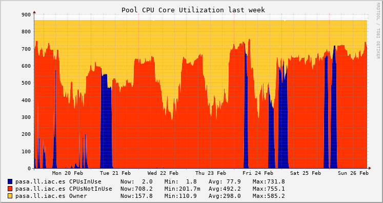

# Table of Contents

1.  [Introduction](#orgd906349)
    1.  [What is HTCondor?](#orgf79e069)
    2.  [How can HTCondor help me?](#org458f29b)
    3.  [How **powerful** is HTCondor?](#orgd33ff5f)
    4.  [Which machines are part of HTCondor?](#org490b438)
    5.  [How can I use HTCondor?](#org252eb2c)
    6.  [Where will my application run?](#org312ddc0)
    7.  [Basic HTCondor workflow](#org4957966)
    8.  [Acknowledging HTCondor in publications](#orga8d590f)
    9.  [Further information and support](#org91ed91d)
2.  [Main HTCondor commands](#org3655d9a)
    1.  [Checking pool status](#org50c6323)
    2.  [Submitting jobs](#org4d1b17b)
    3.  [Checking and managing submitted jobs](#org8664184)
    4.  [Getting info from logs](#org999a29c)
    5.  [Other commands](#orgdc938b1)
3.  [Submit files (TBD)](#org6e99616)
    1.  [Introduction](#org1540be3)
    2.  [Creating a Submit File](#orge83a633)
        1.  [Comments](#org7fcac20)
        2.  [Variables and macros](#org4bae2fc)
        3.  [Submit commands](#org707549e)
    3.  [Templates and examples](#org656d85e)
        1.  [Common Template](#org9359976)
        2.  [Examples when working with input/output files and arguments](#orgeed05b1)
            1.  [**Example A** (arbitrary filenames)](#orgc15b839)
            2.  [**Example B** (based on ProcessID, old system before HTCondor v8.4.0)](#orga906505)
            3.  [**Example C** (lists of files and arguments written in submit file)](#org313fe0f)
            4.  [Example D (lists of files and arguments in external file)](#orgee16682)
            5.  [Example E (`stdin`, `initialdir` external scripts and lists)](#orgd5fe620)
            6.  [Example F (loops)](#orgf407aca)
            7.  [Example G](#org3b946ed)

# Introduction

If you have no experience with HTCondor, we recommend that you contact us before
running any job so we can give you a quick introduction (bear in mind that you
will be using other users' computers and there are some basic guidelines that
you must follow to avoid disturbing them).

The HTCondor infrastructure at the IAC has been recently expanded and improved,
with about 100 new Linux desktop PCs financed by the Ministry of Economy and
Competitiveness through FEDER funds, code IACA13-3E-2493. 

## What is HTCondor?

At the IAC we have several [Supercomputing](http://research.iac.es/sieinvens/SINFIN/Main/supercomputing.php) resources that allow you to obtain
your computational results in much less time and/or work with much more complex
problems. One of them is [HTCondor](http://research.cs.wisc.edu/htcondor/), a High Throughput Computing ([HTC](http://en.wikipedia.org/wiki/High-throughput_computing)) system. The
underlying idea is quite simple (and powerful): let's use idle machines to
perform computations while their owners are away. So, in a nutshell, HTCondor is
an application that is installed in our PCs to make it possible to run a large
number of yours and others' computations at a time in different machines when
they are not being used, achieving a better utilization of our resources. A more
detailed overview of HTCondor is available at the [official documentation](https://htcondor.readthedocs.io/en/v10_0/overview/index.html).

## How can HTCondor help me?

HTCondor is very useful when you have an application that has to run a large
number of times over different input data. For instance, suppose you have a
program that carry out some calculations taking an image file as input. Let's
say that the processing time is about one hour per image and you want to process
250 images. Then you can use your own machine and process all images one by one,
and wait more than 10 days to get all results, or you can use HTCondor to
process each image in different computers and hopefully get all results in one
hour, or maybe two or four, but for sure less than 10 days. And HTCondor will do
all the work for you: it will copy the input files to the remote machines,
execute your program there with different inputs and bring back the results to
your machine when they are complete.

## How **powerful** is HTCondor?

HTCondor calls a *slot* the unit that executes a job, typically a CPU or a core
if the CPU has several of them. Right now we have over 1000 slots that might
execute applications submitted via HTCondor. It means that everyday more than
24000 hours could be available to run HTCondor jobs, close to 3 years of
computation in a single day! Obviously, this is the theoretical maximum if no
one were using their computers and all slots were idle, but the number of actual
available slots could be around 400 during office hours and around 700 at nights
and weekends.

You can see real-time **HTCondor@IAC statistics** (global and per user) [here](http://pasa/ganglia/?r=week&cs=&ce=&m=load_one&tab=v&vn=pool_usage&hide-hf=false). Figure
[7](#org241a71c) is an example showing the global usage where *Owner* represents
*slots* that are being used outside of HTCondor. The remaining *slots* are
available to HTCondor, but if there are no eligible jobs to run, those slots
will be in *CPUsNotInUse* state. Those *slots* that are actually being used by
HTCondor are those in the *CPUsInUse* state.

## Which machines are part of HTCondor?

HTCondor is installed in a number of *burros* (High Performance Linux PCs) and
desktop PCs at the IAC Headquarters in La Laguna. 

Regarding their hardware specifications, they are rather heterogeneous and their
availability and specifications change from time to time. You can check which
machines make up the HTCondor@IAC pool at any given time in the [HTCondor Ganglia
webpage](http://pasa/ganglia/?r=week&cs=&ce=&c=IAC+HTCondor&h=&tab=m&vn=&hide-hf=false&m=cpu_num&sh=1&z=small&hc=4&host_regex=&max_graphs=0&s=by+name). 

Regarding their software specifications, at present all machines are running
Ubuntu 18.04 and the installed software should be also more or less the same in
every machine (see the [software supported by the SIE](http://research.iac.es/sieinvens/SINFIN/Main/software_sinfin.php)), which makes it easy to
run almost every application in any machine.

Detailed information about each machine can be obtained with the command
`condor_status` (see Section [2.1](#org50c6323)). 

HTCondor provides a simple mechanism by which you can specify a set of
requirements for the machines where you want your application to run, for
example: memory per slot, OS version, etc. (see Section [3](#org6e99616)).

## How can I use HTCondor?

If you have an account in the IAC network, then you can use HTCondor. 

HTCondor is a batch-processing system (i.e. non-interactive), so you submit jobs
to the HTCondor queue with the `condor_submit` command, and providing a text
submission file, where you specify the executable file, its arguments, inputs
and outputs, etc. (see Section [2.2](#org4d1b17b)).

You do not need to prepare or compile your programs in any special way to run
them, and almost all programming languages should be suitable (shell scripts,
Python, Perl, C, Fortran, IDL, etc.). Sometimes a few minor modifications may be
needed in order to specify arguments and the locations of inputs or outputs.

## Where will my application run?

When you submit jobs to the HTCondor queue, HTCondor uses its allocation
algorithm to send and execute your jobs on those idle slots that satisfy your
requirements. Idle slots are those located in machines where there has been no
keyboard/mouse activity for a long time and the computer load is low enough to
ensure that there is no interference with the owner's processes. 

While HTCondor is running its jobs, it also keeps checking that the owner is not
using the machine. If HTCondor detects any activity in the computer (for
instance, keyboard activity), then it will suspend all its jobs and wait a
little while to see whether the machine gets idle again so as to resume the
jobs. If the machine does not become idle in a short time, HTCondor will
*vacate* it, interrupting all HTCondor jobs and sending them to other available
slots in any other idle machine. 

HTCondor will repeat this process untill all jobs are done, optionally sending
notifications via email when they are finished or if any errors show up.

## Basic HTCondor workflow

The basic workflow with HTCondor will include four steps: checking the HTCondor
pool status, submitting a job, checking and managing the submitted job, and
getting information from the logs. Commands and examples for these phases are
given with further details in the following sections, but here we present a very
basic example to **Quick Start** you. 

-   **Checking the HTCondor pool status**
    
    You can use the command `condor_status`, to quickly check the status of the
    HTCondor pool:
    
        [angelv@denso ~]$ condor_status -compact
        Machine             Platform     Slots Cpus Gpus  TotalGb FreCpu  FreeGb  CpuLoad ST
        
        cruise.dyn.iac.es   x64/Ubuntu18 _        4          7.64      1     1.91    0.00 Oi
        dama.ll.iac.es      x64/Ubuntu18 _       40        754.54      1    18.86    0.00 Ui
        
        [...]
        
        villa.dyn.iac.es    x64/Ubuntu18 _       16        187.58      1    11.72    0.00 Oi
        virus.dyn.iac.es    x64/Ubuntu18 _        8         62.73      1     7.84    0.02 Oi
        
                       Total Owner Claimed Unclaimed Matched Preempting Backfill  Drain
        
          x64/Ubuntu18   868   318       2       548       0          0        0      0
        
                 Total   868   318       2       548       0          0        0      0

-   **Submitting a job**
    
    In order to ask HTCondor to run you application you will need:
    
    -   **your application**
        
        For example, given the following basic C code (`simple.c`):
        
            #include <stdio.h>
            
            main(int argc, char **argv)
            {
                int sleep_time;
                int input;
                int failure;
            
                if (argc != 3) {
                    printf("Usage: simple <sleep-time> <integer>\n");
                    failure = 1;
                } else {
                    sleep_time = atoi(argv[1]);
                    input      = atoi(argv[2]);
            
                    printf("Thinking really hard for %d seconds...\n", sleep_time);
                    sleep(sleep_time);
                    printf("We calculated: %d\n", input * 2);
                    failure = 0;
                }
                return failure;
            }
        
        You would compile it as usual:
        
            gcc -o simple simple.c
    
    -   **a *submit file***
        
        The submit file specifies the name of your executable (`simple`), how many
        jobs to submit (`Queue 100`), etc.
        
            Universe   = vanilla
            Executable = simple
            Arguments  = 400 10
            Log        = simple.log
            Output     = simple.$(Process).out
            Error      = simple.$(Process).error
            nice_user  = True
            
            Queue 100
    
    -   **the `condor_submit` command**
        
        Using the *submit file* as an argument to the command `condor_submit` you
        instruct HTCondor to start executing your job in the HTCondor Pool.
        
            [angelv@denso ~]$ condor_submit test.condor
            Submitting job(s)...........................................................
            100 job(s) submitted to cluster 4.

-   **Checking the progress of the submitted jobs**
    
    The basic command to check on the progress of your jobs is `condor_q`. In the
    following example we can see that all the 100 jobs submitted above are successfully
    running:
    
        [angelv@denso ~]$ condor_q
        
        -- Schedd: denso.ll.iac.es : <161.72.216.13:9618?... @ 02/27/23 09:27:40
        OWNER  BATCH_NAME    SUBMITTED   DONE   RUN    IDLE  TOTAL JOB_IDS
        angelv ID: 4        2/27 09:24      _    100      _    100 4.0-99
        
        Total for query: 100 jobs; 0 completed, 0 removed, 0 idle, 100 running, 0 held, 0 suspended 
        Total for angelv: 100 jobs; 0 completed, 0 removed, 0 idle, 100 running, 0 held, 0 suspended 
        Total for all users: 100 jobs; 0 completed, 0 removed, 0 idle, 100 running, 0 held, 0 suspended

-   **Getting information from the logs**
    
    If everything goes well, when the jobs finish, any output files created by
    your application will be, by default, copied back to the directory whence you
    submitted your job. 
    
    At the same time, you can instruct HTCondor to save to files any output that
    your application produces. In the example above, the *standard output*
    generated by each job is written to a file called `simple.$(Process).out`,
    where `$(Process)` will be automatically substituted by HTCondor by the number
    of each job (in this case, given that we submitted 100 jobs, the numbers will
    go from 0 to 99). For example, the file `simple.0.out` could read:
    
        [angelv@denso ~]$ cat simple.0.out 
        Thinking really hard for 400 seconds...
        We calculated: 20
    
    Also, a global log of the steps taken by HTCondor to execute your jobs can
    generated (in the example above called `simple.log`). This log will give you
    details of when each job was submitted, when it started executing, whether it
    was evicted or had any other problems, etc. In this example, the file
    `simple.log` could read: 
    
        [angelv@denso ~]$ cat simple.log 
        000 (004.000.000) 2023-02-27 09:24:41 Job submitted from host: <161.72.216.13:9618?addrs=161.72.216.13-9618+[2001-720-1610-50d8--d]-9618&alias=denso.ll.iac.es&noUDP&sock=schedd_3008_d0f7>
        ...
        000 (004.001.000) 2023-02-27 09:24:41 Job submitted from host: <161.72.216.13:9618?addrs=161.72.216.13-9618+[2001-720-1610-50d8--d]-9618&alias=denso.ll.iac.es&noUDP&sock=schedd_3008_d0f7>
        ...
        000 (004.002.000) 2023-02-27 09:24:41 Job submitted from host: <161.72.216.13:9618?addrs=161.72.216.13-9618+[2001-720-1610-50d8--d]-9618&alias=denso.ll.iac.es&noUDP&sock=schedd_3008_d0f7>
        
        [...]
        
        040 (004.002.000) 2023-02-27 09:24:47 Started transferring input files
                Transferring to host: <161.72.216.8:9618?addrs=161.72.216.8-9618+[2001-720-1610-50d8-21e-4fff-feba-8ff9]-9618&alias=delta.ll.iac.es&noUDP&sock=slot4_3147_1899_416>
        ...
        040 (004.003.000) 2023-02-27 09:24:47 Started transferring input files
                Transferring to host: <161.72.216.8:9618?addrs=161.72.216.8-9618+[2001-720-1610-50d8-21e-4fff-feba-8ff9]-9618&alias=delta.ll.iac.es&noUDP&sock=slot5_3147_1899_414>
        
        [...]
        
        001 (004.002.000) 2023-02-27 09:24:48 Job executing on host: <161.72.216.8:9618?addrs=161.72.216.8-9618+[2001-720-1610-50d8-21e-4fff-feba-8ff9]-9618&alias=delta.ll.iac.es&noUDP&sock=startd_2745_6b8f>
        ...
        001 (004.003.000) 2023-02-27 09:24:48 Job executing on host: <161.72.216.8:9618?addrs=161.72.216.8-9618+[2001-720-1610-50d8-21e-4fff-feba-8ff9]-9618&alias=delta.ll.iac.es&noUDP&sock=startd_2745_6b8f>
        
        [...]
        
        005 (004.040.000) 2023-02-27 09:31:45 Job terminated.
                (1) Normal termination (return value 0)
                        Usr 0 00:00:00, Sys 0 00:00:00  -  Run Remote Usage
                        Usr 0 00:00:00, Sys 0 00:00:00  -  Run Local Usage
                        Usr 0 00:00:00, Sys 0 00:00:00  -  Total Remote Usage
                        Usr 0 00:00:00, Sys 0 00:00:00  -  Total Local Usage
                58  -  Run Bytes Sent By Job
                8432  -  Run Bytes Received By Job
                58  -  Total Bytes Sent By Job
                8432  -  Total Bytes Received By Job
                Partitionable Resources :    Usage  Request Allocated
                   Cpus                 :        0        1         1
                   Disk (KB)            :       24       10 207282725
                   Memory (MB)          :        0        1      4024
        
                Job terminated of its own accord at 2023-02-27T09:31:44Z with exit-code 0.

## Acknowledging HTCondor in publications

It is important that you acknowledge HTCondor in any publication of your work
where you have used HTCondor (and we would be grateful if you could send us the
details of the published paper). This will help us to improve the visibility of
the HTCondor@IAC facility and ensure that it is available at the IAC for the
foreseable future. Although there is no standard acknowledgment format, we
suggest the following:

This paper made use of the IAC Supercomputing facility HTCondor
(<http://research.cs.wisc.edu/htcondor/>), partly financed by the Ministry of
Economy and Competitiveness with FEDER funds, code IACA13-3E-2493.

## Further information and support

This manual is only a brief introduction to all HTCondor has to offer. For
detailed and complete information, check the official [HTCondor v10.0 Manual](https://htcondor.readthedocs.io/en/v10_0/).

If you need help or you are having any kind of issues related to HTCondor,
the SIE gives direct support to IAC's users who want to use HTCondor: we
will not code your whole application, but we will help and advise you on how to
get the most out of HTCondor. 

If you want to stay informed about HTCondor@IAC updates, tips, etc. there is a
low traffic mailing list (send us an e-mail if you want to subscribe to it).

# Main HTCondor commands

HTCondor provides around 100 commands (see the [Command Reference Manual)](https://htcondor.readthedocs.io/en/v10_0/man-pages/index.html), but
you will only need a few of them for most of you work with HTCondor. In this
section we introduce the most common ones, grouped according to the four common
tasks introduced in section [1.7](#org4957966): Checking pool status
([2.1](#org50c6323)), Submitting jobs ([2.2](#org4d1b17b)), Checking and
managing submitted jobs ([2.3](#org8664184)) and Getting info
from logs ([2.4](#org999a29c)). For each command we also give a list of some
of their most useful options (but note that you can also get full details about
each command by executing `man condor_<cmd>` in your shell).

## Checking pool status

-   **`condor_status`** list slots in the HTCondor pool and their status: `Owner` (used
    by owner), `Claimed` (used by HTCondor), `Unclaimed` (available to be used
    by HTCondor), etc. 
    -   **`-avail`** List those slots that are not busy and could run HTCondor jobs at
        this moment
    -   **`-submitters`** Show information about the current general status, like
        number of running, idle and held jobs (and submitters)
    -   **`-run`** List slots that are currently running jobs and show related
        information (owner of each job, machine where it was submitted from, etc.)
    -   **`-compact`** Compact list, with one line per machine instead of per slot
    -   **`-state -total`** List a summary according to the state of each slot
    -   **`-master`** List machines, but just their names (status and slots are not
        shown)
    -   **`-server`** List attributes of slots, such as memory, disk, load, flops, etc.
    -   **`-sort Memory`** Sort slots by Memory, you can try also with other attributes
    -   **`-af <attr1> <attr2> <...>`** List specific attributes of slots, using
        autoformat (new version, very powerful)
    -   **`-format <fmt> <attr>`** List attributes using the specified format (old
        version). For instance, next command will show the name of each slot and the
        disk space: `condor_status -format "%s\t " Name -format "%d KB\n" Disk`
    -   **`<machine>`** Show the status of a specific machine
    -   **`<machine> -long`** Show the complete "ClassAd" of a machine (its
        specifications). We can use these specifications to add restrictions in the
        submit file so we can control which machines we want to use.
    -   **`-constraint <constraint>`** Only Show slots that satisfy the
        constraint. I.e: `condor_status -constraint 'Memory > 1536'` will only show
        slots with more than 1.5GB of RAM per slot.

## Submitting jobs

-   **`condor_submit <submit_file>`** Submit jobs to the HTCondor queue according to
    the information specified in `submit_file`. Visit the **submit file page** to
    see some examples of these files. There are also some FAQs related to the
    submit file. 
    -   **`-dry-run <dest_file>`** this option parses the submit file and saves all
        the related info (name and locations of input and output files after
        expanding all variables, value of requirements, etc.) to `<dest_file>`, but
        jobs are **not** submitted. Using this option is highly recommended when
        debugging or before the actual submission if you have made some
        modifications in your submit file and you are not sure whether they will
        work.
    -   **`'var=value'`** add or modify variable(s) at submission time, without
        changing the submit file. For instance, if you are using `queue $(N)` in
        your submit file, then `condor_submit <submit_file> 'N = 10'` will submit 10
        jobs. You can specify several pairs of `var=value`.
    -   **`-append <command>`** add submit commands at submission time, without
        changing the submit file. You can add more than one command using several
        times `-append`.

When submitted, each job is identified by a pair of numbers **X.Y**, like
345.32. The first number (**X**) is the **cluster id**: every submission gets a
different cluster id, that is shared by all jobs belonging to the same
submission. The second number (**Y**) is the **process id**: if you submitted N
jobs, then this id will go from 0 for the first job to N-1 for the last one. For
instance, if you submit a file specifying 4 jobs and HTCondor assign id 523 to
that cluster, then the ids of your jobs will be 523.0, 523.1, 523.2 and 523.3
(you can get these ids and more info using `condor_q` command).

Before submitting your jobs, always do some simple tests in order to make sure
that both your submit file and program work in a proper way: if you are going to
submit hundreds of jobs and each job takes several hours to finish, before doing
that try with just a few jobs and change the input data in order to let them
finish in minutes. Then check the results to see if everything went fine before
submitting the real jobs. Bear in mind that submitting untested files and/or
jobs may cause a waste of time and resources if they fail, and also your
priority will be lower in following submissions.

## Checking and managing submitted jobs

Each machine manages its own HTCondor queue, so it has information only about
those jobs that were submitted on it (and no information about any other jobs
you may have submitted on other machines). Most of the commands explained in
this section get information asking only the local queue, which means that you
will only see those jobs that you have submitted on that specific machine. If
you submit jobs from different machines, and later you want to check, hold,
release, remove, etc. those jobs, you may need to connect to each one of those
machines where you have submitted jobs from, or, when possible, use the commands
with extra options to communicate with other machines.

-   **`condor_q`** Show my jobs that have been submitted in this machine. By default
    you will see the ID of the job(`clusterID.processID`), the owner, submitting
    time, run time, status, priority, size and command. **STATUS** can be: **I**:idle
    (waiting for a machine to execute on); **R**: running; **H**: on hold (there was
    an error, waiting for user's action); **S**: suspended; **C**: completed; **X**:
    removed; **<**: transferring input; and **>**: transferring output. 
    
    

    HTCondor will, by default, show only your jobs. If you want to use all
    users' submitted jobs, you can use the option **`-allusers`**
    
    

    
    -   **`-global`** Show my jobs submitted in any machine, not only the current one
    -   **`-nobatch`** Starting in version HTCondor 8.6.0 installed in January 2017,
        data is displayed in a compact mode (one line per cluster). With this option
        output will be displayed in the old format (one line per process)
    -   **`-wide`** Do not truncate long lines. You can also use `-wide:<n>` to
        truncate lines to fit `n` columns
    -   **`-analyze <job_id>`** Analyse a specific job and show the reason why it is in
        its current state (useful for those jobs in Idle status: Condor will show us
        how many slots match our restrictions and may give us suggestion)
    -   **`-better-analyze <job_id>`** Analyse a specific job and show the reason why
        it is in its current state, giving extended info
    -   **`-long <job_id>`** Show all information related to that job
    -   **`-run`** Show your running jobs and related info, like how much time they
        have been running, in which machine, etc.
    -   **`-currentrun`** Show the consumed time on the current run, the cumulative
        time from last executions will not be used (you can combine also with `-run`
        flag to see only the running processes at the moment)
    -   **`-hold`** Show only jobs in the "on hold" state and the reason for that. Held
        jobs are those that got an error so they could not finish. An action from
        the user is expected to solve the problem, and then he should use the
        `condor_release` command in order to check the job again
    -   **`-af <attr1> <attr2> <...>`** List specific attributes of jobs, using
        autoformat
    -   **`-global -submitter <user>`** Show all jobs from user `<user>` in all
        machines.

-   **`condor_tail <job_id>`** Display on screen the last lines of the `stdout`
    (screen) of a running job on a remote machine. You can use this command to
    check whether your job is working fine, you can also visualize errors
    (`stderr`) or output files created by your program (see also
    CondorFAQs#ssh). Useful options:
    -   **`-f`** Do not stop displaying the content, it will be displayed until
        interrupted with `Ctrl+C`
    -   **`-no-stdout -stderr`** Show the content of `stderr` instead of `stdout`
    -   **`-no-stdout <output_file>`** Show the content of an output file (`output_file`
        has to be listed in the `transfer_output_files` command in the submit file).

-   **`condor_release <job_id>`** Release a specific held job in the queue. Useful
    options: 
    
    -   **`<cluster_id>`** Instead of giving a `<job_id>`, you can specify just the
        `<cluster_id>` in order to release all held jobs of a specific submission
    -   **`-constraint <constraint>`** Release all my held jobs that satisfy the
        constraint
    -   **`-all`** Release all my held jobs
    -   **Note:** Jobs with ''on hold'' state are those that HTCondor was not able
    
    to properly execute, usually due to problems with executable, paths, etc. If
    you can solve the problems changing the input files and/or the executable,
    then you can use `condor_release` command to run again your program since it
    will send again all files to the remote machines. If you need to change the
    submit file to solve the problems, then `condor_release` will NOT work because
    it will not evaluate again the submit file. In that case you can use
    `condor_qedit` (see the HOWTOs.CondorFAQs#chsubmit) or cancel all
    held jobs and re-submit them again-]

-   **`condor_hold <job_id>`** Put jobs into the hold state. It could be useful
    when you detect that there are some problems with your input data (see
    CondorFAQs#badinputs for more info), you are running out of disk space for
    outputs, etc. With this command you can delay the execution of your jobs
    holding them, and, after solving the problems, assign them the idle status
    using `condor_release`, so they will be executed again. Useful options:
    -   **`<cluster_id>`** Instead of giving a `<job_id>`, you can specify just the
        `<cluster_id>` in order to hold all jobs of a specific submission
    -   **`-constraint <constraint>`** Hold all jobs that satisfy the constraint
    -   **`-all`** Hold all my jobs from the queue

-   **`condor_rm <job_id>`** Remove a specific job from the queue (it will be
    removed even if it is running). Jobs are only removed from the current
    machine, so if you submitted jobs from different machines, you need to remove
    your jobs from each of them. Useful options:
    -   **`<cluster_id>`** Instead of giving a `<job_id>`, you can specify just the
        `<cluster_id>` in order to remove all jobs of a specific submission
    -   **`-constraint <constraint>`** Remove all jobs that satisfy the constraint
    -   **`-all`** Remove all my jobs from the queue
    -   **`-forcex <job_id>`** It could happen that after removing jobs, they don't
        disappear from the queue as expected, but they just change status to
        **X**. That's normal since HTCondor may need to do some extra operations. If
        jobs stay with 'X' status a very long time, you can force their elimination
        adding `-forcex` option. For instance: `condor_rm -forcex -all`.

-   **`condor_prio`** Set the priority of my jobs. A user can only change the
    priority of her own jobs, to specify which ones she would like to run first
    (the higher the number, the bigger the priority). Priority could be absolute
    or relative, use `man condor_prio` for further information

-   **`condor_ssh_to_job <job_id>`** Create an ssh session to a running job in a
    remote machine. You can use this command to check whether the execution is
    going fine, download/upload inputs or outputs, etc. More information about
    this command is available in CondorFAQs#ssh.

## Getting info from logs

-   **=\*condoruserlog** <file.log>=\* Show and summarize job statistics from the job
    log files (those created when using `log` command in the submit file)

-   **`*condor_history*`** Show all completed jobs to date (it has to be run in the
    {<del>same machine</del>} where the submission was done). Useful options:
    -   **`-userlog <file.log>`** list basic information registered in the log files (use
        `condor_logview <file.log>` to see information in graphic mode)
    -   **`-long XXX.YYY -af LastRemoteHost`** show machine where job XXX.YYY was
        executed
    -   **`-constraint <constraint>`** Only show jobs that satisfy the constraint. I.e:
        `condor_history -constraint 'RemoveReason`!=UNDEFINED'=: show your jobs that
        were removed before completion

-   **`condor_logview <file.log>`** This is not an original HTCondor command, we have
    created this link to the script that allows you to display graphical
    information contained in the log of your executions.

-   There is also an online tool to analyze your log files and get more
    information: `HTCondor Log Analyzer` (<http://condorlog.cse.nd.edu/>).

## Other commands

-   **`condor_userprio`** Show active HTCondor users' priority. Lower values means
    higher priority where 0.5 is the highest. Use `condor_userprio -allusers` to
    see all users' priority, you can also add flags `-priority` and/or `-usage` to
    get detailed information
-   **`condor_qedit`** use this command to modify the attributes of a job placed on
    the queue. This may be useful when you need to change some of the parameters
    specified in the submit file without re-submitting jobs (see
    HOWTOs.CondorFAQs#chsubmit).
-   **`condor_submit_dag <dag_file>`** Submit a DAG file, used to describe jobs
    with dependencies. Visit the CondorHowTo#howtodagman section for more info
    and examples.
-   **`condor_version`** Print the version of HTCondor.
-   If you want some general information about HTCondor queue, the pool of
    machines, where jobs have been executed on, etc., you can try our online stats
    about HTCondor: <http://carlota:81/condor_stats/> and <http://nectarino/>.

# Submit files (TBD)

## Introduction

To execute your application with HTCondor, you have to specify some parameters
like the name of your executable, its arguments, inputs and outputs,
requirements, etc. This information is written in a plain text using **submit
commands** in a file called ''HTCondor Submit Description File'' or simply
**submit file**. Once that file is filled with all needed info, you have to submit
it to HTCondor using `*condor_submit*` in your terminal, and then it will be
processed and your jobs will be added to the queue in order to be executed.

**Submit files have considerably changed after the release of versions 8.4.X**
(first version 8.4.0 released in Sept 2015, since Feb 2017 we are using versions
8.6.X). Some operations were not possible or highly painful in previous versions
(like dealing with an undetermined number of files with arbitrary names,
declaring variables and macros and performing operations with them, including
submission commands from other files, adding conditional statements, etc.). To
solve that, many researchers developed external scripts (perl, python, bash,
etc.) to dynamically create description files and submit them, what in most
cases resulted in complex submissions and less efficient executions, not to
mention that usually it was needed a hard work to adapt those scripts when the
application, arguments and/or IO files changed.

With the addition of [new, powerful and flexible commands](http://research.cs.wisc.edu/htcondor/manual/v8.6/2_5Submitting_Job.html#SECTION00352000000000000000) most of those problems
have been solved, so there should be no need of using external scripts and \*we
highly recommend you always use a HTCondor submit description file instead of
developing scripts in other languages\*. If you did that in the past, please,
consider migrating your old scripts, we will give you support if you find any
problems.

In this section you will find templates and examples of HTCondor Submit
Description Files. Use them as reference to create your own submit files and
contact us if you have any doubt or issue. Topics:

-   Creating a submit file (description and structure of
    submit files: comments, variables, commands, etc.)
-   Templates and examples of submit files
-   OLD examples
-   Some more useful commands and info

**Caution!: Before submitting your real jobs, perform always some simple tests**
 in order to make sure that both your submit file and program will work in a
 proper way: if you are going to submit hundreds of jobs and each job takes
 several hours to finish, before doing that try with just a few jobs and change
 the input data in order to let them finish in minutes. Then check the results
 to see if everything went fine before submitting the real jobs. Also we
 recommend you use `condor_submit *-dry-run*` to debug your jobs and make sure
 they will work as expected, see **useful commands** page). Bear in mind that
 submitting untested files and/or jobs may cause a waste of time and resources
 if they fail, and also your priority will be lower in following submissions.

## Creating a Submit File

As many other languages, HTCondor submit files allow the use of comments,
variable, macros, commands, etc. Here we will describe the most common ones, you
can check the [official documentation](https://research.cs.wisc.edu/htcondor/manual) for a complete and detailed
information about submit files and submitting process.

### Comments

HTCondor uses symbol `*#*` for comments. Everything found after that symbol will
be ignored. Please, do not mix commands and comments in the same line, since it
may produce errors. We recommend you always write commands and comments in
different lines.

    # This is a valid comment
    A = 4  # This may produce errors when expanding =A=, do not use comments and 
           #  anything else in the same line!

### Variables and macros

There are many predefined variables and macros in HTCondor that you can use, and
you can define your own ones.

-   To **define a variable**, just chose a valid name (names are case-insensitive)
    and assign a value to it, like `N = 4`, `Name = "example"`
-   To **get the value** of a variable, use next syntax: `$(varName)`, both `$`
    symbol and parentheses `()` are mandatory.
-   You can do **basic operations** with variables, like `B = $(A) + 1`, etc. (since
    version 8.4.0 is not needed to use the old and complex syntax [@$$[(&#x2026;)]@]
    for the operations). To get the expression evaluated, you may need to use
    function macros like `$INT(B)`, `$REAL(B)`, etc.
-   There are several special **automatic variables** defined by HTCondor that will
    help you when creating your submit file. The most useful one is `*$(Process)*`
    or `$(ProcId)`, that will contain the Process ID of each job (if you submit
    `N` jobs, the value of `$(Process)` will be `0` for the first job and `N-1` in
    the last job). This variable is like an **iteration counter** and you can use it
    to specify different inputs, outputs, arguments, &#x2026; for each job. There are
    some **automatic variables**, 
    like `$(Cluster)` or `$(ClusterId)` that stores the ID of each submission,
    `$(Item)`, `$(ItemIndex)`, `$(Step)`, `$(Row)`, etc. (see **Example1** for
    further information).
-   There are several **pre-defined Function Macros**. Their syntax is
    `*$FunctName(varName)*` and they can perform some operations on variable
    `varName` like evaluating expressions and type conversions, selecting a value
    from a list according an index, getting random numbers, string operations,
    filenames processing, setting environment variables, etc. Before creating your
    own macros, check if HTCondor has already a **pre-defined Function Macro** with
    the same purpose.

### Submit commands

You will need to add several HTCondor submit commands in your script file in
order to specify which executable you want to run and where it is located, its
arguments if any, input files, which result files will be generated, etc. There
is a wide set of HTCondor with almost 200 different **submit description file
commands** to cover many different scenarios. But in most situations you will
only need to specify a few of them (usually about 10-15). Here we will present
the most common ones (commands are case-insensitive):

-   **Mandatory commands:**
    -   `*executable*`: specify where your executable is located (you can use an
        absolute path, a relative one to the directory where you do the submission
        or to another directory specified with `initialdir`). You should specify
        **only the executable** and not other things like arguments, etc., there are
        specific commands for that. HTCondor will automatically copy the executable
        file from your machine to any machine where your job will be executed, so
        you do not need to worry about that.
    -   `*queue*`: this command will send your job(s) to the queue, so it should be
        the last command in your submit file. In previous versions of HTCondor it
        was quite limited, only allowing the number of jobs as argument. But since
        version 8.4.0, this command is very powerful and flexible, and you can use
        it to specify variables, iterations over other commands, files to be
        processed, list of arguments, etc. **see complete syntax and examples**.

-   **Highly recommended commands:**
    -   `*output*`: it will copy the standard output printed on the screen
        (`stdout`) of the remote machines when executing your program to the local
        file you specify here. Since all the jobs will use the same name, the
        filename should include some variable parts that change depending on the job
        to avoid overwritten the same file, like `$(Process)` (and also `$(Cluster)`
        if you do not want that different submissions ruin your output files). Even
        if your program does not print any useful results on screen, it is very
        recommended you save the screen output to check if there were errors, debug
        them if any, etc.
    -   `*error*`: the same as previous command, but for standard error output
        (`stderr`).
    -   `*log*`: it will save a log of your submission that later can be analysed
        with HTCondor tools. This is very useful when there is any problem with your
        job(s) to find the problem and fix it.  The log should be the same for all
        jobs submitted in the same cluster, so you should **not** use `$(Process)` in
        the filename (but including `$(Cluster)` is recommended).
    -   `universe`: there are several **runtime environments** in HTCondor called
        ''universes'', we will mostly use the one named `vanilla` since it is the
        easiest one. This is the universe by default, so if you miss this command,
        your jobs will also go to `vanilla` universe.

-   **Useful commands when working with inputs and outputs (arguments, files,
    keyboard, etc.)**:
    -   `*arguments*`: it is used to specify options and flags for your executable
        file, like when using it in command line.
    -   `*should_transfer_files*`: assign `YES` to it in order to activate HTCondor
        file transfer system (needed when working with files).
    -   `*when_to_transfer_output*`: it will usually have a value of `ON_EXIT` to
        only copy output files when your job is finished, avoiding the copy of
        temporary or incomplete files if your job fails or it is moved to another
        machine.
    -   `*transfer_input_files*`: it is used to specify where the needed input files
        are located. We can use a comma-separated list of files (with absolute or
        relative paths, as mentioned in `executable` command). Local path will be
        ignored, and HTCondor will copy all files to the root directory of a virtual
        location on the remote machine (your executable will be also copy to the
        same place, so input files will be in the same directory). If you specify a
        directory in this command, you can choose if you want to copy only the
        content of the directory (add a slash "`*/*`" at the end, for instance
        `myInputDir*/*`) or the directory itself and its content (do not add a
        slash).
    -   `*transfer_output_files*`: a comma-separated list of result files to be
        copied back to our machine. If this command is omitted, HTCondor will
        automatically copy all files that have been created or modified on the
        remote machine. Sometimes omitting this command is useful, but other times
        our program creates many temporary or useless files and we only want to get
        the ones we specify with this command.
    -   More commands for input/output files:
        -   `transfer_output_remaps`: it changes the name of the output files when
            copying them to your machine. That is useful when your executable
            generates result file(s) with the same name, so changing the filename to
            include a variable part (like `$(Process)` and maybe also `$(Cluster)`)
            will avoid overwritten them.
        -   `initialdir`: this command is used to specify the base directory for input
            and output files, instead of the directory where the submission was
            performed from. If this command include a variable part (like
            `$(Process)`), you can use this command to specify a different base
            directory for each job.
        -   `input`: if your program needs some data from keyboard, you can specify a
            file or a comma-separated list of files containing it (each end of line in
            the file will have the same behaviour as pressing `Intro` key in the
            keyboard, like when using `stdin` redirection in command line with
            `*<*`). As other similar commands, you can use absolute or relative paths.
        -   `transfer_executable`: by default its value is `True`, but if it is set to
            `False`, HTCondor will not copy the executable file to the remote
            machine(s). This is useful when the executable is a system command or a
            program that is installed in all machines, so it is not needed to copy it.

-   **Other useful commands:**
    -   `request_memory`, `request_disk`: if your program needs a certain amount of
        total RAM memory or free disk space, you can use these commands to force
        that your jobs will be only executed on machines with at least the requested
        memory/free disk space **HowTo**
    -   `requirements`: this is a very useful command if your program has any
        special needs. With it you can specify that your job can be only executed on
        some machines (or some machines cannot run your program) according to a wide
        set of parameters (machine name, operative system and version and a large
        etc.) **HowTo**
    -   `rank`: you can specify some values or combination of them (total memory,
        free disk space, MIPS, etc.) and HTCondor will choose the best machines for
        your jobs according to your specifications, where the higher the value, the
        better (this command is used to specify preferences, not requirements)
        **HowTo**
    -   `getenv`: if it is set to `True`, all your environment variables will be
        copied at submission time and they will be available when your program is
        executed on remote machines (if you do not use this command or it is set to
        `False`, then your jobs will have no environment variables). This is useful
        when running some programs that need a special environment, like python,
        etc. **HowTo**
    -   `nice_user`: if it is set to `True`, your jobs will be executed with a fake
        user with very low priority, what could be very useful when the queue is
        (almost) empty, so you can run your jobs without wasting your real user
        priority (you can activate and deactivate this feature when your jobs are
        being executed, so you can begin running your jobs as nice user if the queue
        is empty and change to normal user when the queue has many other jobs, or
        vice versa) **HowTo**
    -   `concurrency_limits`: you can limit the maximum number of your jobs that
        could be executed at the same time. You should use this command if your
        program needs licences and there are a few of them (like `IDL`, see also
        **CondorAndidlvirtualmachine**) or if for any reason you cannot use the
        HTCondor file transfer system and all your jobs access to the same shared
        resource (`/scratch`, `/net/nas`, etc.), in order to avoid that too many
        concurrent access can stress the network **CondorHowTo#howtolimit**
    -   `include`: since HTCondor v8.4.0, it is possible to **include externally
        defined submit commands** using syntax: `*include :* ''<myfile>''`. You can
        even include the output of external scripts that will be executed at
        submission time, adding a pipe symbol after the file: `*include :*
            ''<myscript.sh>'' *|*`
    -   More useful commands:
        -   `environment`: this command will allow you to set/unset/change any
            environment variable(s) **CondorHowTo#howtoenv**
        -   `priority`: if some of your jobs/clusters are more important than others
            and you want to execute them first, you can use `priority` command to
            assign them a priority (the higher the value, the higher priority). This
            command only have an effect on your own jobs, and it is not related to
            users priority **CondorHowTo#howtopriority**.
        -   `job_machine_attrs`, `job_machine_attrs_history_length`: use these
            commands to reduce the effects of ''black holes'' in HTCondor, what causes
            that many of your jobs could fail in a short time
            **CondorHowTo#howtofailing**
        -   `noop_job`: you specify a condition and those jobs that evaluate it to
            true will not be executed. This is useful when some of your jobs failed
            and you want to repeat only the failing jobs, not all of them
            **CondorHowTo#howtofailing**
        -   `+PreCmd`, `+PreArguments`, `+PostCmd`, `+PostArguments`: These commands
            allow you to run some scripts before and/or after your executable. That is
            useful to prepare, convert, decompress, etc. your inputs and outputs if
            needed, or debug your executions **CondorHowTo#howtoprepostcmd**
        -   `notify_user`, `notification`: use these commands if you want to receive a
            notification (an email) when your jobs begin, fail and/or finish
            **CondorHowTo#howto\_notify**
        -   `if` &#x2026; `elif` &#x2026; `else` &#x2026;  `endif`: since HTCondor version 8.4.0, a
            **limited conditional semantic** is available. You can use it to specify
            different commands or options depending on the defined/undefined
            variables, HTCondor version, etc.
        -   `on_exit_hold`, `on_exit_remove`, `periodic_hold`, `periodic_remove`,
            `periodic_release`, etc.: you can modify the default behaviour of your
            jobs and the associated status. These commands can be used in a wide set
            of circumstances. For instance, you can force that jobs that are running
            for more than X minutes or hours will be deleted or get a ''on hold''
            status (with this you can prevent that failing jobs will be running
            forever, since they will be stopped or deleted if they run for a much
            longer while than expected) or the opposite, hold those jobs that finish
            in an abnormal short time to check later what happened. Or you can also
            periodically release your held jobs, to run them on other machines if for
            any reason your jobs work fine on some machines, but fail on others
            **CondorHowTo#howtofailing**
        -   `deferrall_time`, `deferral_window`, `deferral_prep_time`: you can force
            your jobs begin at a given date and time. That is useful when the input
            data is not ready when submitting and your jobs have to wait till a
            certain time **CondorHowTo#howtorunintime**

## Templates and examples

Here you can find basic templates of submit files, you can use them as starting
point and then do the customizations needed for your executions. Check the
examples in following sections for details and explanations.

### Common Template

    ######################################################
    # HTCondor Submit Description File. COMMON TEMPLATE   
    # Next commands should be added to all your submit files   
    ######################################################
    if !defined FNAME
      FNAME = condor_exec
    endif
    ID      = $(Cluster).$(Process)
    
    output  = $(FNAME).$(ID).out
    error   = $(FNAME).$(ID).err
    log     = $(FNAME).$(Cluster).log
    
    universe                = vanilla
    should_transfer_files   = YES
    when_to_transfer_output = ON_EXIT

-   **Explanation:**
    
    Let's analyse the common template: 
    
    -   First block:
        -   Here we will define some variables that will be used later. The first of
            them is `FNAME` and first we ask with the `if defined` condition whether
            that variable is not already defined (if so, we will use the previous
            value). This variable will contain the base name for the files where
            HTCondor will save the information displayed on the screen (`stdout` and
            `stderr`) and the log file. It is interesting to give a common name to
            those files generated by HTCondor so later we can identify and manage them
            together. Since all jobs will use the name specified there, we have to
            include a variable part that has to be different in each job, in order to
            avoid overwriting the files. We recommend you use a combination of
            `$(Process)` (it contains the process ID that is different for each job)
            and `$(Cluster)` (it contains the cluster ID that is different for each
            submission), as we have done when defining `$(ID)`. In this way, different
            jobs and different submission will use different filenames and none of
            them will be overwritten.
    -   Second block:
        -   With `output` command we force HTCondor to write in the specified file all
            the screen output (`stdout`) generated by each job. We have used the
            variables `$(FNAME)` and `$(ID)` defined above.
        -   With `error` command we manage `stderr` in the same way we did with
            `output`.
        -   Then we have also specified a HTCondor log file with `log` command. You
            should not use `$(Process)` in the filename of the log since all jobs
            should share the same log.
    -   Third block:
        -   `universe`: there are **runtime environments**
            in HTCondor called ''universes'', we will mostly use the one named
            `vanilla` since it is the easiest one. This is the universe by default, so
            if you miss this command, your jobs will go also to `vanilla` universe.
        -   `should_transfer_files=YES` and `when_to_transfer_output=ON_EXIT` commands
            are used to specify that input files have to be copied to the remote
            machines and output files must be copied back to your machine only when
            our program is finished. Although these commands are only needed when
            working with files, we recommend you always use them unless you are
            totally sure you can omit them.

### Examples when working with input/output files and arguments

Most times you will want to run applications that deal with input and/or output
files. Commonly, the input files will be located on your local machine, but
since your application will be executed on other machine(s), it will be needed
to copy your input files there, and then copy the result files back to your
computer once your program is done. HTCondor have some commands to automatically
do both operations in an easy way, so you do not need to worry about the file
transfers: you just need to specify where your files are and HTCondor will copy
them.

**Note:** All these examples will begin defining a specific variable `FNAME` that
contains the base name of the files that HTCondor will generate to save the
`stdout`, `stderr` and log. Next, the common template explained above with be
included using command `include` (we assume that the common template filename is
`condor_common.tmpl`).

#### **Example A** (arbitrary filenames)

Process all input files with extension `.in` in a given directory with next
program: `./myprogram -i inputFile -o outputFile`

    # Including Common Template
    FNAME = exampleA
    include : /path/to/condor_common.tmpl
    
    transfer_input_files    = $(mydata)
    transfer_output_files   = $Fn(mydata).out
    
    executable    = myprogram
    arguments     = "-i $Fnx(mydata) -o $Fn(mydata).out"
    
    queue *mydata* matching files /path/to/inputs/*.in

-   **Explanation:** 
    We use `transfer_input_files` to specify where the needed input files are
    located. We can use a comma-separated list of files, but since we do not know
    the name of the files, we will use the variable `mydata` to specify them. That
    variable is defined in the last line, with the `queue` command: there, we choose
    to process all files in `/path/to/inputs` with extension `.in`. When submitting,
    HTCondor will check that directory and it will automatically create a job for
    each `.in` file found there, assigning the complete filename to `mydata` (in
    this way, each job will work with a different file). We have used the `matching
      files` to specify that we only want files matching the condition, but we can
    also select only directories (`matching dirs`) or both of them (just
    `matching`).
    
    With `transfer_output_files` we set the name of the output files, that is the
    same as the input file with `.out` extension. To remove the old extension we use
    the `$Fn` macro, that is one of the **new Function Macros**
    available since version 8.4.0, used to operate the filename and extract the
    path, name without extension, extension, etc.
    
    Then we use `executable` to specify the name of the executable (it can be a
    system command, your own application, a script, etc). We can use a absolute path
    or a relative one to the directory where we will perform the submission. This
    executable will be copied to all remote machines automatically. Finally,
    `arguments` is used to specify the options for the program. We have to employ
    again `Fpdnxq` macros, first `Fnx` to remove the original path (file we be
    copied to the root of a virtual location where HTCondor will run the executable
    on the remote machine) and then `Fn` to remove path and change extension of the
    output file.

#### **Example B** (based on ProcessID, old system before HTCondor v8.4.0)

Process 50 input files with consecutive names (from data0.in to data49.out)
using the same program as previous example

    # Including Common Template
    FNAME = example2
    include : /path/to/condor_common.tmpl
    
    transfer_input_files    = /path/to/inputs/data$(Process).in
    transfer_output_files   = data$(Process).out
    
    N             = 50
    executable    = myprogram
    arguments     = "-i data$(Process).in -o data$(Process).out"
    
    queue $(N)

-   **Explanation:**
    `transfer_input_files` command allows a comma-separated list of files or
    directories that will be copied to the remote machine. Local path will be
    ignored, and HTCondor will copy all files to the root directory of a virtual
    location on the remote machine (your executable will be also copy to the same
    place, so input files will be in the same directory). If you specify a directory
    in this command, you can choose if you want to copy only the content of the
    directory (add a slash "`*/*`" at the end, for instance `myInputDir*/*`) or the
    directory itself and its content (do not add a slash). In this case, each job
    will process a different input file, and since they have a consecutive name
    beginning from `0`, we will use HTCondor macro `$(Process)` to build the proper
    name, since the process ID will be `0` from the first job to `N-1` for the last
    job.
    
    With `transfer_output_files` we specify a comma-separated list of result files
    to be copied back to our machine. In this case, we specify just one file, with
    the same name as the input file, but with `.out` extension.
    
    Then we define the variable `N` to specify the number of jobs to be
    executed. Our program is set using `executable` command and with `arguments`
    command we specify all the needed options (here the name of the input and output
    file with the corresponding flags).
    
    At the end, we send all jobs to the queue with `queue` command, specifying how
    many jobs we want (we have used the variable `N`).

#### **Example C** (lists of files and arguments written in submit file)

Process all arbitrary files and arguments of a given list. Executable is
 `myprogram` and it needs an input file with extension `.dat` and some
 arguments. Results will be printed on screen (`stdout`). 

    # Including Common Template
    FNAME = exampleC
    include : /path/to/condor_common.tmpl
    
    executable    = myprogram
    
    queue transfer_input_files,arguments *from* (
      xray434.dat, -d 345 -p f034
      sunf37.dat,  -d 2   -p f302
      light67.dat, -d 62  -p f473
    ) 

-   **Explanation:**

We will use the flexibility of `queue` command to assign values of a list to
several commands. We must specify which files must be transferred and which
arguments are needed by each file. We specify then `transfer_input_files` and
`arguments` commands using the `from` option, and then we add a list of pairs
''file,argument''.

At submission time, HTCondor will iterate over the list and expand the
assignations. For instance, our jobs will have next values:

-   `transfer_input_files = xray434.dat, arguments = -d 345 -p f034-`
-   `transfer_input_files = sunf37.dat, arguments = -d 2   -p f302-`
-   `transfer_input_files = light67.dat, arguments = -d 62  -p f473-`

When using this format you can specify as many commands separated by commas as
needed between `queue` and `from`, but check that each line in the list has the
right number of elements also separated by commas.

Writing the list of items in the submit file can be a little bit tedious, but it
may be easily done in an external file using scripts. Then you can directly
specify the file. For instance, suppose you have all items in a file named
`data.lst`, then you can use next `queue` command: 
`queue transfer_input_files,arguments from /path/to/data.lst`

#### Example D (lists of files and arguments in external file)

Process arbitrary files and arguments stored in file `data.lst` (process only
 lines from 28 to 43, both inclusive, with step 5). Executable is `myprogram` as
 in previous example, but this time it saves the result in a file named
 `output.out`. 

    # Including Common Template
    FNAME = exampleD
    include : /path/to/condor_common.tmpl
    
    transfer_output_files  = output.out
    line                   = $(Row)+1
    transfer_output_remaps = "output.out=output$INT(line).out"
    
    executable    = myprogram
    
    queue transfer_input_files,arguments *from* [27:43:5] data.lst

-   **Explanation:**

This example is similar to the previous one, but this time the list of input
files and arguments is written in a file with the following format:

    [input_file1,args1]
    [input_file2,args2]
    [input_file3,args3]
    ...

To illustrate the **slice** feature, we have been asked to process only items
(lines) from 28 to 43 with step 5 (28, 33, 38 and 43), this could be useful when
we want to run only certain experiments. The syntax for the slices is very easy,
the same as Python: `[init:end:step]`. Since the first index is 0, but we do not
use line 0 but line 1, the `init` should be 27. Then the `end` is 43 (it should
be 42, but we need to add 1 because the upper limit is included according to our
example). So we specify the slice using `[27:43:5]` in the `queue` command,
between the `from` clause and the file.

We have to be careful with the results. Our program writes them in a file named
`output.out`. We cannot get all files with the same name because they will be
overwritten, so we need to use `transfer_output_remaps` to change names when
copying from remote machines to our. We can add the `$(Process)` variable to the
new name, so all of them will be different, but then it could be a little bit
complicated to identify each result. Instead, we will use another of the
**automatic variables**, called `$(Row)`. It stores the number of the row in the
list that is being processed, that is, almost the number of the line: since
`$(Row)` begins in 0, we need to add 1 to get the line number. We do that in
variable `$(line)`. Then, HTCondor will process rows 27, 32, 37 and 42, and our
output files will be `output28.out`, `output33.out`, `output38.out` and
`output43.out`.

#### Example E (`stdin`, `initialdir` external scripts and lists)

Our program `myprogram` works with `stdin` (keyboard is used to specify input
data). We have written that input data in 4 files (`dataFeH.in`, `dataOFe.in`,
`dataOH.in` and `dataHe.in`) and there is a set of 3 different experiments in
directories (`dir000`, `dir001` and `dir002`). Output files will be generated
with the same name as inputs and extension `.out` (use `-o` argument) and they
must be located in the same directory where the respective input file
is. Program also needs all `*.tbl` files located in `/path/to/tables`.

    # Including Common Template
    FNAME = exampleE
    include : /path/to/condor_common.tmpl
    
    N            = 3
    input        = data$(met).in
    initialdir   = /path/to/dir$INT(Step,%03d)
    include      : input_tables.sh |
    transfer_output_files = data$(met).out
    
    executable   = myprogram
    arguments    = "-o data$(met).out"
    
    queue $(N) *met* *in* FeH, OFe, OH, He

-   **Explanation:**

The key of this example is the `queue` command in last line. We are using the
clause `*in*` to specify a list of values. HTCondor will create a job for each
element in the list and the current value will be assigned to the variable `met`
that we have declared (this variable is optional, you can omit it and use the
automatic variable `Item`). We have 3 set of experiments, so we need to go over
the list 3 times, that is why we have defined `N = 3` and we are using `$(N)` in
the `queue` command. So, at the end, HTCondor will execute 12 jobs (3 runs \* 4
elements in the list): we will use automatic variable `$(Step)` to get the
number of the present run (0, 1 or 2) and `$(met)` (or `$(Item)` if we omit the
variable) to get the value of the current element in the list.

`input` command is used to specify a file that will be used as `stdin`, using
variable `$(met)` to get the proper filename. That variable will be also used
when building the name of the output files (`transfer_output_files` command) and
the arguments (`arguments` command).

We use `initialdir` to specify a base directory that changes according to the
current job, using the automatic variable `$(Step)`. HTCondor will use this
directory as base for the relative paths, so it will affect the input and output
files, including the `stdout`, `stderr` and log files created by HTCondor (see
common template). We use `$INT(Step,%03d)` to get a 3-digit number (000, 001
and 002) to build the proper path for each experiment, then HTCondor will go to
the right directory to get the input files and to place later the respective
output files there.

Last thing we have to solve is the problem with the required input files (all
`*.tbl` files located in `/path/to/tables`). HTCondor does not allow globbing in
`transfer_input_files`, but instead we can use the new feature of **including
external files** with `include` command. This command not only include other
files, but also invoke them if the command finish with a **bar** `*|*`. Then we
can easily make a external script to get the list of needed files with linux
command `ls` and options `-m` (commas are used to separate elements) and `-w`
(used to specify the wide of the screen before adding a new line. Since we need
all elements in the same line, we should specify a number big enough). In this
case, our external script `input_tables.sh` is the following one:

    #!/bin/bash
    echo "transfer_input_files = `ls -w 400 -m /path/to/tables/*.tbl`"

#### Example F (loops)

Execute each iteration of a 3-level nested loop using: `myprogram -dim1 i -dim2
j -dim3 k = with the following ranges: =i:[0,20)`, `j:[0,15)` and
`k:[0,35)`. Output will be written on screen, no input files are needed.

    # Including Common Template
    FNAME = exampleF
    include : /path/to/condor_common.tmpl
     
    MAX_I = 20
    MAX_J = 15
    MAX_K = 35
    
    N = $(MAX_I) * $(MAX_J) * $(MAX_K)
    
    I = ( $(Process) / ($(MAX_K)  * $(MAX_J)))
    J = (($(Process) /  $(MAX_K)) % $(MAX_J))
    K = ( $(Process) %  $(MAX_K))
    
    executable = myprogram
    arguments  = "-dim1 $INT(I) -dim2 $INT(J) -dim3 $INT(K)"
    
    queue $(N) 

-   **Explanation:**

In this example we only need to ''simulate'' a 3 nested loops from a 1-level
loop (we will use `$(Process)` as main loop counter). The 3-level loop will be
the next ones, and HTCondor will create a job for each iteration:

    for (i = 0; i < MAX_I; i++)
      for (j = 0; j < MAX_J; j++)
        for (k = 0; k < MAX_K; k++)
          ./myprogram  -dim1 i -dim2 j -dim3 k

Then we only need to set the limits (`MAX_I`, `MAX_J`, `MAX_K`), the number of
total iterations (`N = $(MAX_I) * $(MAX_J) * $(MAX_K)`) and use some maths to
get the values of `I`, `J` and `K` according the value of `$(Process)`, as we
have done above (just a few multiplications, integer divisions and remeinders
are needed). 

For a 2-level loop, you can use next code:

    I = ($(Process) / $(MAX_J))
    J = ($(Process) % $(MAX_J))

#### Example G

This example shows the use of several useful commands for specific
conditions. It is also a summary of the **CondorHowTo**, you can find
further details and explanation about the submit commands there. 

-   Execute `myprogram` with argument "=-run =" from 0 to 99 by default.
-   **BLOCK A**: Execute only on machines with at least 4GB RAM and 2GB of free
    disk space. The higher memory and the faster calculations, the better (we can
    use KFLOPS to choose the faster machines doing floating point operations, but
    since memory and kflops have different units, we need to weight them, for
    instance, multiplying memory by 200).
-   **BLOCK B**: Execute only on machines with Linux Fedora21 or upper and avoid
    executing on `cata`, `miel` and those with hostname beginning with letter `m`
    or `d`.
-   **BLOCK C**: It is needed to run script `processData.sh` before (argument:
    `-decompress`) and after (argument: `-compress`) to prepare our data.
-   **BLOCK D**: Our executable needs the environment variables and variable `OUT`
    has to be set with the argument.
-   **BLOCK E**: Avoid **black holes** (when your jobs do not execute correctly on
    a machine, and since they finish quickly, that machine is getting most of the
    jobs).
-   **BLOCK F**: Get a notification via email when errors in the job. If the job
    finishes before 5 minutes or takes more than 2 hours to be done, there was a
    problem: hold it to check later what happened.
-   **BLOCK G**: Our program needs licenses, so we cannot run more than 20 jobs at
    the same time. Execute jobs as **nice user** to save priority since there are
    no other jobs running at this moment.

    # Including Common Template
    FNAME = exampleG
    include : /path/to/condor_common.tmpl
    
    if !defined N
      N = 100
    endif
    
    #BLOCK A
    requested_memory = 4 GB
    requested_disk   = 2 GB
    rank             = (200 * Memory) + KFLOPS
    
    #BLOCK B
    letter           = substr(toLower(Target.Machine),0,1)
    requirements     = (UtsnameSysname == "Linux") 
            && (OpSysName == "Fedora") && (OpSysMajorVer >= 21) 
            && !stringListMember(UtsnameNodename, "cata,miel")
            && !stringListMember($(letter), "m,d")
    
    
    #BLOCK C
    transfer_input_data = processData.sh
    +PreCmd             = "processData.sh"
    +PreArguments       = "-decompress"
    +PostCmd            = "processData.sh"
    +PostArguments      = "-compress"
    
    #BLOCK D
    getenv              = True
    environment         = "OUT$(Process)"
    
    #BLOCK E
    job_machine_attrs = Machine  
    job_machine_attrs_history_length = 5           
    requirements = $(requirements) 
          && (target.machine =!= MachineAttrMachine1)  
          && (target.machine =!= MachineAttrMachine2)
    
    #BLOCK F
    notify_user       = myuser@iac.es
    notification      = Error
    
    on_exit_hold = ((CurrentTime - JobStartDate) < (5 * 60)
    periodic_hold = ((JobStatus == 2) 
             && (time() - EnteredCurrentStatus) >  (2  $(HOUR)))
    
    #BLOCK G
    concurrency_limits = myuser$(Cluster):50
    nice_user = True
    
    executable = myprogram
    arguments  = "-run $(Process)"
    
    queue $(N) 

**IMPORTANT**: Although your program could use shared locations
(`/net/XXXX/scratch`, `/net/nasX`, etc.) to read/write files from any machine so
there is no need to copy files, we highly recommend **you always use the HTCondor
file transfer system** to avoid network congestion since files will be accessed
locally on the remote machines. Bear in mind that HTCondor can execute hundreds
of your jobs at the same time, and if all of them concurrently access to the
same shared location, network could experience a huge stress and fail. If for
any reason you cannot copy files and you have to use shared locations -you are
using huge files of several GB, etc.-, then contact us before submitting to
adapt your jobs in order to avoid network congestion. 

